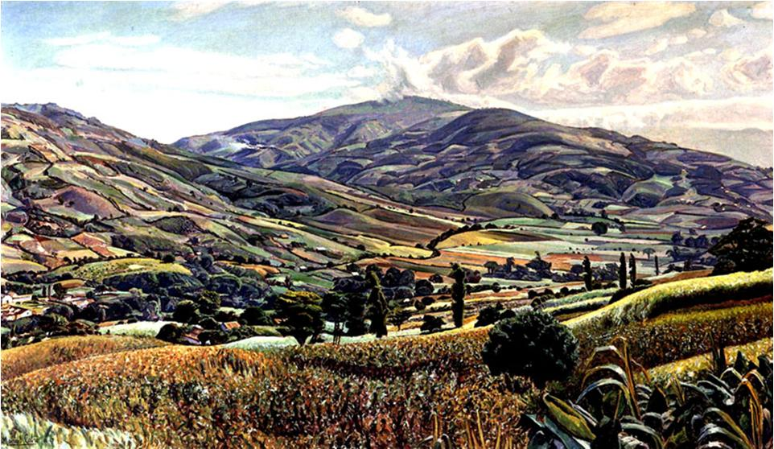

# La Luz como materia en la Arquitectura

---
#### Desarrollo de proyecto arquitectónico autosostenible, comprendido en un Museo de Arte Contemporáneo *Galería La Otra Banda* y zona rental para la Universidad de Los Andes, ubicada en la ciudad de Mérida-Venezuela; aplicando como principio teórico compositivo la temática de *La Luz como materia en la Arquitectura*.
---

<!--  -->
> **Figura 1:**
> *Peribeca*.
> Óleo sobre tela,
> (1942).
> Manuel Cabré.[^1]

***La luz como materia en la arquitectura***, consiste en una investigación que evalúa valores históricos, artísticos y arquitectónicos basados en el fenómeno de la llegada de la modernización a Latinoamérica y con mayor precisión en la *arquitectura emocional* expresada en la obra de *Luis Barragán*. La evaluación de esta fuente de referencia persigue la finalidad de poner en evidencia los mecanismos y/o herramientas empleadas en los elementos de estudio, para actuar como palanca conceptual en la elaboración de un Museo de Arte Contemporáneo para la ciudad de Mérida en Venezuela.

La aplicación de la luz con mayor relevancia en la arquitectura, se obtiene a través del aprovechamiento de la luz solar; constituyendo el recurso con mayor abundancia disponible en la naturaleza, con la cualidad de otorgar el sentido de orientación y la sensación de espacio a los seres vivientes, a pesar de las variaciones de sus características lumínicas en el transcurso del día y de la estación del año.[^2]

La captación de la luz solar en la vida del hombre, ha constituido una fuente de energía fundamentalmente necesaria; de modo que la selección de los espacios de la ciudad de Mérida en Venezuela, actúan como un como lienzo en blanco para emplazar el proyecto arquitectónico de un Museo de Arte Contemporáneo, estableciendo un escenario adecuado para las exposiciones, a través de una arquitectura pensada desde el recurso indispensable.[^3]

La presente investigación, toma como marco de referencia conceptual los criterios arquitectónicos empleados en la obra de Luis Barragán, en favor del aprovechamiento de la luz natural, de tal manera que las características espaciales delimitadas por la creación arquitectónica, se componga de un entorno construido de mayor calidad espacial y persiga fines que sobrepasen lo funcional para contribuir al dinamismo sensorial del sujeto que vive la arquitectura.

[^1]: Vista del valle del pueblo de Peribeca en Táchira, Venezuela. *Enlace:* https://bitacorasamisan.blogspot.com/2013/05/manuel-cabre-y-los-paisajes-del.html

[^2]: Según el **(Instituto para la Diversificación y Ahorro de la Energía et al., 2005)**, *«Es un hecho que, a la hora de iluminar una tarea visual, el ser humano prefiere la luz natural a la luz artificial o luz eléctrica. La luz procedente del sol tiene un perfecto rendimiento de los colores y aporta elementos muy proactivos en el comportamiento de las personas.»*

[^3]: Según **(López et al., 1999)**, los artistas de la *escuela de Caracas*, destacaron la cualidad de la luz incidente en la cordillera de Los Andes, presentando características de especial valor plástico, por lo que la selección del lugar confiere valor añadido afín al tema estudiado.
