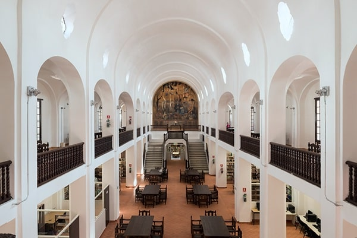
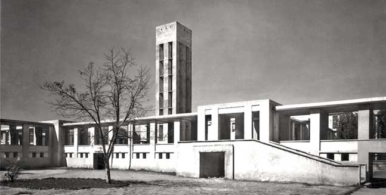

# La Arquitectura Mexicana del siglo XX

:::note info

***Hubo un importante avance en la arquitectura mexicana durante el siglo XX, que se asentó en el panorama mundial como un ejemplo de arquitectura moderna a través del resultado de diversas dinámicas que posibilitaron el enriquecimiento cultural y arquitectónico.***

***Como consecuencia de estos procesos históricos, nace la Escuela Mexicana de Arquitectura, que contó con reconocidas figuras representativas del acontecer arquitectónico del siglo XX; de tal período, un arquitecto en especial es de nuestro interés para el estudio de la luz como materia en la arquitectura. Ese personaje: Luis Barragán.***

***En la siguiente sección, se describe una breve recapitulación de los hechos que posibilitaron este enriquecimiento arquitectónico; a continuación se describe parte de la obra y pensamiento de Barragán y por último, se hacen observaciones personales acerca de los artilugios arquitectónicos y compositivos que podemos aprovechar de su obra para aplicarlos de manera favorable en el proyecto arquitectónico.***

:::

## La Revolución Mexicana y la Arquitectura

> *«... El nacionalismo se constituyó en una de las reivindicaciones transhistóricas de nuestro país fuera de la cual era inentendible el desarrollo nacional»*
>
> **Vargas, R.** "La arquitectura de la Revolución Mexicana. Un enfoque social" en México, 75 años de Revolución, México, FCE, 1988, P. 443.

### Panorama histórico

 

<!--  -->

> **Figura 2:**
> *Entrenamiento de reclutas constitucionalistas en 1915*.
> De10.[^1]

Entre los años de 1910 a 1917 se inició un conflicto armado en México con motivo de la oposición a la perpetuación del poder del general *Porfirio Díaz*, resultando en una guerra civil de la lucha por la *«auténtica revolución».*

> *Diferentes grupos tenían como bandera los derechos políticos y sociales, intereses que los unieron para luego llevar a cabo una guerra de guerrillas a lo largo de una de las épocas más convulsas para México, que dejó más de un millón de muertos.*
>
> BBC Mundo.[^2]

Aunque se trató de una lucha por el poder, trajo consigo el germen del desarrollo en muchos aspectos para el país; la primera consecuencia de la revolución mexicana posibilitó la constitución de 1917, la cual constituyó el elemento legal que estableció el reconocimiento de los derechos sociales y laborales de los mexicanos; heredando así, las directrices del liberalismo francés a nivel mundial.

La corriente ideológica que posibilita el desarrollo de una arquitectura propia, surge de este hilo de acontecimientos, aportando a la conciencia política nacional, una gesta que busca el establecimiento de un arte nacional representativo, sin la finalidad de replicar los símbolos culturales prehispánicos y tradicionales, sino que en su lugar se establecen las pautas para reinterpretarlos en conjunto con las corrientes modernas de la arquitectura, los sistemas constructivos, programáticos y tipológicos que aplican a la construcción.

El primer evento político que acerca la llegada de la arquitectura moderna a México, ocurre en el marco de la celebración por el centenario de la independencia nacional y van dirigidos por *Justo Sierra*[^3] quien otorga a la Universidad Nacional recientemente inaugurada, el encargo de *«coordinar las directrices de carácter nacional»*, afirmando en la ocasión:

> *«Todo ese mundo precortesiano cuyos archivos monumentales venís a estudiar aquí, es nuestro, es nuestro pasado, nos lo hemos incorporado como un preámbulo que cimienta y explica nuestra verdadera historia nacional, la que data de la unión de conquistados y conquistadores para fundar un pueblo mestizo... que está adquiriendo el derecho de ser grande».*
>
> **Sierra, J.** *"Discurso de la sesión inaugural del XVII congreso internacional de Americanistas", 8 de septiembre de 1810. P.3*

En general, la voluntad que emanaba de los discursos oficiales y las nuevas instituciones que se creaban era particular: El establecimiento de una actitud centrada y enraizada a las propias tradiciones, el rescate de las particulares modalidades del vivir nacional y en suma, una política cultural nacionalista que en el ámbito intelectual, encontrase el ambiente propicio para dar sus primeras exploraciones.

:::note info
 💡 El establecimiento de las políticas sociales en México a principios de siglo, suponen la gesta de una corriente nacionalista que asentaría el impulso de la arquitectura de la *revolución mexicana*.
:::

El acelerado abandono de las antiguas formas de vida y la prosecución de unas nuevas, constituye una ruptura de la inercia que a principios del siglo XX, principalmente beneficia a *la clase media y obrera de la nación*, además suceden fenómenos económicos y políticos, que logran incrementar el aprovechamiento de los recursos naturales y humanos; haciendo modificaciones en el panorama político, social y económico; fundando las bases de la revolución mexicana, donde se leía en memorias de los partícipes:

> *«...la búsqueda de un país más justo, más equitativo, más humano y gracias a ello se encontraba anímicamente dispuesto a compartir las formas de pensar, de actuar y de ser de los demás y gozar de sus cánticos y bailes, sus leyendas y tradiciones; no solo eran indicios sino que la ola de entusiasmo se hacía sentir en la comunidad, el cambio estaba en marcha, la revolución se daba».*
>
> **Lombardo, V.**[^4]

:::note info
💡 ***¿A qué conclusión desembocó este movimiento entusiasta en la ciudadanía del momento?***

A la de un país cuyas modalidades materiales y espirituales toman una valorización positiva por parte de la conciencia colectiva para asentar una nación acorde sus demandas:
:::

> *«Y con optimista estupor nos dimos cuenta de insospechadas verdades. Existía México como un país con capacidades, con aspiración, con vida, con problemas propios ¡Existían México y los mexicanos!... Nació el propósito de reivindicar todo lo que pudiera pertenecernos: el petróleo y la canción, la nacionalidad y las ruinas... Quienes no vivieron ese año (1910) de México, apenas podrán comprender algunas cosas. De tal manera que no se concibe una alteración social que merezca el nombre de revolución que no haya realzado con pasión y sinceridad la sustancia espiritual del hombre».*
>
> **Gómez, M.** [^5]

:::note info
💡 En base a este panorama, se desarrolla una atmósfera que favorece el desarrollo de México en distintos ámbitos; por lo que es de nuestro interés analizar cómo el ecosistema arquitectónico, se ve modificado por los procesos históricos que se listan a continuación.
:::

### La constitución de 1917

La influencia que la revolución mexicana imprime en el ámbito de la arquitectura, se distingue al generar las condiciones legales que posibilitaron el desarrollo del país en el campo educativo, de atención médica y demás servicios necesarios a su población. Toma como punto de partida, el asentamiento de los derechos constitucionales de los trabajadores establecidos de la siguiente manera:

> *«En primer lugar el derecho de los trabajadores a contar con habitaciones y la obligación de los patrones de proporcionarlas mediante un alquiler que no podía exceder "del medio por ciento del valor catastral de las fincas". En segundo término, prescribió las condiciones que debían contener estas habitaciones: "cómodas e higiénicas". En tercer lugar, el equipamiento con que contarían sus asentamientos "escuelas, enfermería y demás servicios necesarios a la comunidad" y cuando "su población exceda los doscientos habitantes, deberá reservarse un espacio de terreno para el establecimiento de mercados públicos, instalación de edificios destinados a servicios municipales y centros recreativos". Por último, se alentaría a quienes construyeran casas "baratas e higiénicas" para ser adquiridas en propiedad».*
>
> **Constitución de 1917,** Art. 123, Fracciones XII, XII y XXX.

:::note info
💡 Por derecho constitucional, se posibilita el beneficio de la clase trabajadora en materia de vivienda y servicios básicos, respondiendo a la demanda de la creciente población, además de gestarse las condiciones que abrirán camino a la nueva arquitectura.

En el transcurso de este proceso, va naciendo de manera gradual pero sostenida, la exigencia por una *«racionalidad»* congruente con el espíritu del momento. En esta época, surgen las siguientes interrogantes:
:::

> *¿Cuál es el objeto de deliberar acerca de la incorporación o no, de formas extraídas de los acerbos históricos extranjeros o propios. Además, cuál sería el sentido que cabía asignarle a la arquitectura y la ciudad las corrientes de modernidad extranjeras si fuere necesario y acerca del establecimiento de sus propios márgenes de acción como doctrina enfocada hacia la ejecución de los proyectos de desarrollo?*
>
> **Vargas, R.**[^6]

Tal fue el impacto de estos cuestionamientos en el quehacer de la construcción y planificación urbana, que para el año 1934, se establece de manera predominante el uso del tabique y concreto como complemento a los materiales de construcción tradicionales. Acelerando los ritmos de producción de edificios, e incrementando las condiciones de salubridad y de programas organizativos de los mismos. Se prestan las condiciones que marcan el ritmo que deviene en el desarrollo de la nación en la época.

En sus primeros años, la arquitectura de la revolución mexicana tiene como objetivo, consolidar los sistemas educativos de la nación. A raíz de estas nuevas disposiciones, surge la demanda de edificios cuyas construcciones se componen de tipologías modernas, buscando satisfacer las diversas funciones requeridas, e incrementando la construcción de escuelas, bibliotecas, centros de esparcimiento y correlativos; aunque no es hasta el segundo cuarto de siglo que se empiezan a sustituir las tipologías coloniales para suplir la demanda requerida. Es en este momento que surge la necesidad, de establecer un nuevo paradigma en la producción de edificaciones.

<!--  -->

> **Figura 3:**
> *Centro Escolar Benito Juárez*.
> Xalapa - México,
> (1922).
> Carlos Obregón Santacilia.[^7]

### Nuevo paradigma teórico

El inicio de la arquitectura moderna nacional, gesta su propio vocabulario formal a través de la extensión del lenguaje de la arquitectura colonial. Sin embargo, pronto se cae en cuenta que pese a la elasticidad de este tipo de arquitectura, las necesidades nacionales, fueron escalando conforme al avance y llegada de las nuevas tecnologías, permitiendo la implementación de sistemas constructivos y modos de organización del espacio, dotando al hombre de ambientes construidos con una mayor incidencia de iluminación natural y mejoras en las condiciones sanitarias para los espacios habitables.

En paralelo a la creciente demanda de vivienda y edificios públicos, existe la necesidad de incrementar el rendimiento de los capitales públicos invertidos y el incremento en el ritmo de producción. Por lo que surge el *cuestionamiento y rechazo* de la arquitectura colonial, en su adaptación al tiempo histórico que atravesó el país en el momento, donde ocurre la llegada de la arquitectura moderna.

> *«Esos primeros cinco años dejaron una lección imborrable en la conciencia de los protagonistas: no era exhumando el pasado, incluso el propio, como transitarían a una arquitectura moderna nacional: no se trasiega el vino nuevo en odres viejos, debieron haber pensado».*[^8]

La arquitectura que inicialmente promovía el secretario de educación *José Vasconcelos*, no satisfizo hasta el momento la demanda requerida por los diversos entes nacionales, lo que implicó, una reconstrucción teórica por parte de los arquitectos, con el objetivo de acompasar el ritmo de construcción de las necesidades existentes.

El arquitecto que postuló una reforma, para solventar esta situación fue *José Villagrán García*; y su planteamiento constituyó las premisas:

> - Asentar teóricamente e imbuir en la conciencia social *«La importancia social de la arquitectura»*; la función social de la arquitectura, la del arquitecto identificado con su pueblo. *«La habitabilidad de los espacios de todo género»*.
> 
> - Lo nacional y lo moderno son aspectos recíprocamente excluyentes. Se realiza un estudio histórico para lograr la síntesis de dos conceptos dicotómicos para la época. Las premisas de lo moderno y lo nacional se aplican en función de la realidad social de las obras de arquitectura, que se posan sobre nuevos espacios; el programa arquitectónico funge como el elemento normal para la determinación de las necesidades sociales, principios de ordenación y compositivos por excelencia.[^9]

:::note info
💡 La propuesta hecha por Villagrán, no plantea una estética definida, sino una *ética profesional* comprometida con su sociedad. La de un arquitecto dispuesto a conocer a fondo los problemas arquitectónicos, en el marco programático y social, para ofrecer soluciones; lo que desprende al país, del uso de principios tradicionales como marco de referencia para la ejecución arquitectónica.
:::

Esta es la base de partida usada para configurar junto a sus estudiantes la *Escuela Mexicana de Arquitectura*, que representa el comienzo de una nueva etapa en la arquitectura mexicana, la piedra angular en el discurrir arquitectónico mexicano del siglo XX. Gracias a esta, se facilitó la posibilidad de producir obras con programas complejos y funciones normadas, como es el caso del *Instituto de Higiene y Granja Sanitaria*, ubicado en Popotla, construido a partir de 1925 y finalizado en 1927; además del *Hospital para tuberculosos*, ubicado en Huipulco, construido desde 1929 hasta 1936, ambas obras diseñadas por el arquitecto José Villagrán García.

<!--  -->

> **Figura 4:**
> *Hospital para tuberculosos*.
> Huipulco - México,
> (1929 - 1936).
> José Villagrán García.[^10]

:::note info
💡 Estas propuestas presentarían las soluciones prototípicas que anteceden a la Escuela Mexicana de Arquitectura, una de las instituciones que representaron el punto de inflexión para el desarrollo de la arquitectura mexicana.
:::

[^1]: Entrenamiento de reclutas constitucionalistas en 1915. *Enlace:* https://de10.com.mx/top-10/todo-lo-que-debes-saber-sobre-la-historia-de-la-revolucion-mexicana

[^2]: **BBC Mundo. (2018, noviembre 18).** Qué fue la Revolución Mexicana y quiénes fueron sus principales líderes. BBC News Mundo. *Enlace:* https://www.bbc.com/mundo/noticias-america-latina-46245076

[^3]: Según **(Villegas Moreno et al., 2011)**, *«Justo Sierra Méndez (San Francisco de Campeche, Campeche, 26 de enero de 1848; Madrid, 13 de septiembre de 1912) fue un escritor, historiador, periodista, poeta, político y filósofo mexicano, discípulo de Ignacio Manuel Altamirano. Fue decidido promotor de la fundación de la Universidad Nacional de México, hoy Universidad Nacional Autónoma de México (UNAM). Se le conoce también como "Maestro de América" por el título que le otorgaron varias universidades de América Latina. Es considerado uno de los personajes más influyentes de la historia moderna de México.»*

[^4]: **Toledano, L. (2000).** El sentido Humanista de la Revolución Mexicana (3era ed.). UNAM.

[^5]: **Gómez Morín, M. (1988).** 1915 y otros ensayos. Conferencias del Ateneo de la Juventud, México. Jus. P.9.

[^6]: **Vargas S., Ramón. (2004).** "El imperio de la razón". En González G., Fernando. La arquitectura mexicana del siglo XX, México. P.89.

[^7]: **Gutierrez, E. (2013, diciembre 13).** Centro Escolar Benito Juárez. Behance. *Enlace:* https://www.behance.net/gallery/13069375/CENTRO-ESCOLAR-BENITO-JUAREZ

[^8]: **González Gortázar, F. (2004).** La arquitectura mexicana en el siglo XX. CONACULTA. P.91.

[^9]: **Villagrán García, J., & Vargas, R. (1988).** Teoría de la arquitectura (1. ed). Universidad Nacional Autónoma de México, Facultad de Arquitectura. P.38.

[^10]: **Carreño, G. (2015, mayo 5).** José Villagrán García y la enseñanza de la arquitectura moderna en México. *Enlace:* https://www.correodelmaestro.com/publico/html5052015/capitulo5/jose_villagran_garcia_y_la_ensenanza.html
