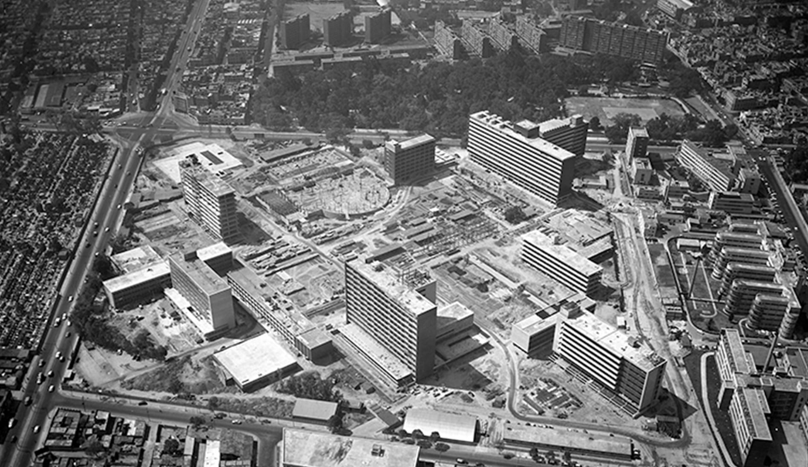
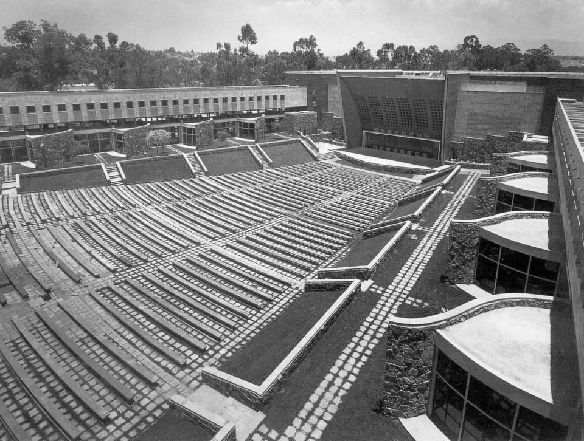
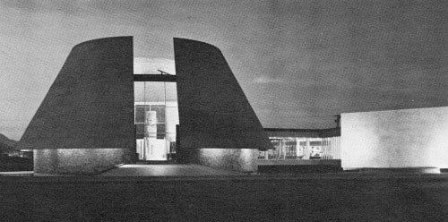
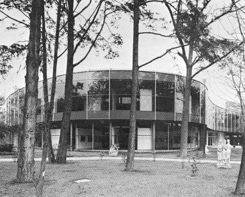

# Escuela Mexicana de Arquitectura

:::note info
***Los antecedentes de la época sientan las bases que constituirían la Escuela Mexicana de Arquitectura, cuyas directrices reaccionan a los postulados de la nueva constitución, puestos en práctica en su mayoría en los edificios públicos y de servicios, tales como hospitales, escuelas y ministerios públicos.***

***La arquitectura educativa mexicana del siglo XX, ve aumentados sus ritmos de producción luego de la adopción de nuevas metodologías aplicadas a los sistemas constructivos de los edificios, incrementando los espacios desplegados en este campo; por lo que en general, el entorno educativo de los años venideros, se vio beneficiado de las propuestas de sus antecesores. Entre otras áreas, comienza el florecimiento de la arquitectura nacional de mayor calidad constructiva y compositiva.***

***Surgen las tendencias arquitectónicas asociadas a la Escuela Mexicana de Arquitectura, cuyo alcance se aplica a equipamientos arquitectónicos urbanos.***
:::

## *La EMA en la salud*

<!--  -->

> **Figura 5:**
> *Vista aérea del complejo del centro médico nacional*.
> Ciudad de México - México,
> (1954 - 1958).
> Enrique Yáñez.[^1]

En el año 1942 se realiza en México el seminario de estudios hospitalarios, que abordó un análisis sobre los factores y funciones fundamentales de los edificios de atención médica, estipulando que las características de los hospitales por construirse se adecuarían a las circunstancias establecidas en el mismo, sin desvincularse de su momento.

El programa arquitectónico, constituyó el elemento organizador de la arquitectura de atención médica, compuesta de funcionalidades complejas y requerimientos lumínicos variados de acuerdo al programa. Se ejemplifican numerosas obras que parten de esta premisa; aunque el ejemplo más notorio se manifiesta en el *Centro Médico Nacional* (1954-1961), proyectado por el arquitecto Enrique Yáñez quien fue uno de los miembros del seminario.

Este complejo constituyó el conjunto hospitalario más grande del país, contando con murales, relieves, esculturas y recubrimientos que hacían referencia a la ornamentación geométrica prehispánica;[^2] dejando de lado el apartado plástico, se justificó un funcionamiento médico preciso gracias a las premisas establecidas en años anteriores.

> El enorme conjunto arquitectónico de la colonia Doctores, orgullo de varias administraciones que fueron sumando unidades de especialidades al proyecto original del Instituto Mexicano del Seguro Social, le tocó vivir trágicos momentos durante los sismos del 19 y 20 de septiembre de 1985.
>
> De aquella parcial reconstrucción surgió el actual Centro Médico Siglo XXI.
>
> El universal MX.[^3]

:::note info
💡 De modo que con el establecimiento del complejo hospitalario, se reflejan las hazañas arquitectónicas significativas al adoptar el *estilo internacional* para la elaboración de edificios públicos; ejemplificando el cambio de paradigma arquitectónico en el ámbito constructivo.
:::

## *La EMA en la educación*

A raíz del avance en materia de salud impuesto por la EMA, las metodologías constructivas tomaron lugar en propuestas análogas al campo de la educación, de manera que surge la creación de un organismo regulador con funciones similares, aplicadas en el ámbito educativo.

Para incluir proyectos escolares en el país y unificar la diversidad de propuestas hasta el momento, el secretario de educación pública *Jaime Torres Bodet*,[^4] creó en 1944 el Comité Administrador del Programa Federal de Construcción de Escuelas.

La comisión técnica del comité se encargó de realizar estudios para determinar la demanda por nuevos jardines de niños, escuelas de primaria y secundaria; a corto y medio plazo, de modo que la resolución del comité generó los encargos que trajeron obras como:

La Escuela Normal de Maestros proyectada por *Mario Pani*, toma las influencias del *movimiento de integración plástica*, con las metodologías modernas de construcción, para desarrollar un proyecto simbólico que con su torre central de 71 metros de altura, coincidiendo con la altura de la columna de la independencia.[^5] Dominó el paisaje hasta su demolición en 1972. Fue inaugurada como la sede de la segunda conferencia mundial de la UNESCO, en noviembre de 1947.

<!--  -->

> **Figura 6:**
> *Escuela Normal de Maestros*.
> Ciudad de México - México,
> (1945 - 1947).
> Mario Pani.[^6]

En 1946 se entregan las instalaciones del *Conservatorio Nacional de Música* proyectados por Pani, obra que en el 2012 se declara Monumento Artístico de la nación.

> *Se trata de una arquitectura integral que se apoya en las estructuras, pero también en las artes como la pintura y la escultura con profundas raíces mexicanas. En el caso del conservatorio, se logra un notable conjunto escultórico de Armando Quezada, ubicado en la curva central de la fachada principal, así como la integración de dos murales de José Clemente Orozco. Este espacio se desarrolla coreográficamente mediante una rigurosa composición que enuncia un recorrido por el edificio, la curva central se extiende hacia la parte posterior del terreno mediante dos brazos que rematan en dos volúmenes de planta circular que corresponden a la sala de ensayos de percusiones y a la biblioteca respectivamente, con este gesto el edificio abraza un auditorio al aire libre meticulosamente hundido y rematado por una concha acústica, empujando de esta manera los gestos proyectuales hacia el máximo aprovechamiento del edificio.*
>
> Archdaily México.[^7]

<!--  -->

> **Figura 7:** 
> *Conservatorio Nacional de Música*.
> Ciudad de México - México,
> (1946).
> Mario Pani.[^8]

<!--  -->

> **Figura 8:**
> *Conservatorio Nacional de Música*.
> Ciudad de México - México,
> (1946).
> Mario Pani.[^9]

:::note info
💡 El conjunto de obras planteadas por los arquitectos, destacan una distribución funcional que constituye uno de los elementos característicos de la influencia de la Escuela Mexicana de Arquitectura y el movimiento de integración plástica en el ámbito de las edificaciones de uso educativo. Además, el uso de los materiales tradicionales, la distribución de los espacios y las formas regulares en los edificios hacen de esta corriente un hito en la arquitectura mexicana.
:::

La producción de obras educativas en la nación, tuvo influencia en la proyección de diversos espacios dedicados al ámbito cultural, trayendo a la ejecución de obras culturales, que permitieron a los arquitectos la experimentación formal en ciertos espacios exteriores, que en conjunto con unas situaciones climáticas favorables, dieron paso a la implementación de patios amplios en los edificios y el uso de sistemas de celosías en fachadas; el empleo de materiales tradicionales y el uso del color, proveniente de unas raíces culturales en evolución, componen los primeros rasgos distintivos de la arquitectura moderna mexicana.

En adelante, como consecuencia de estos primeros acercamientos, surgen en la década de los sesenta la construcción de nuevos museos de arte. Ejemplos destacados, a saber:

<!--  -->

> **Figura 9:**
> *Museo de Arte de Ciudad Juárez (Museo Fronterizo)*.
> Ciudad Juárez, Chihuahua - México,
> (1962).
> Pedro Ramírez Vázquez y Rafael Mijares.[^10]

<!--  -->

> **Figura 10:**
> *Museo de Arte Moderno, Paseo de la Reforma*.
> Ciudad de México - México,
> (1964).
> Pedro Ramírez Vázquez y Rafael Mijares.[^11]

La proyección y el desarrollo de las obras culturales componen los elementos que aportan en el componente de planificación, a través del programa que interacciona con diversos valores arquitectónicos relacionados con:

- La complejidad de la funcionalidad de los espacios.
- La relación con el entorno natural e histórico.
- El desarrollo y respuesta de una inquietud cultural creciente por parte de la población.

De esta manera, la arquitectura cultural otorga valores educativos y turísticos al ecosistema urbano de las diversas ciudades en desarrollo del país.

:::note info
💡 Esta corriente de obras ejemplifican los alcances de la Escuela Mexicana de Arquitectura, a partir de la segunda mitad del siglo XX, el Estilo Internacional empieza a tomar influencia sobre la manera de construir y proyectar la arquitectura en México.
:::

[^1]: **Plataforma Arquitectura. (2020, abril 10).** Arquitectura para la salud: El Centro Médico Nacional Siglo XXI en Ciudad de México. *Enlace:* https://www.plataformaarquitectura.cl/cl/871189/arquitectura-hospitalaria-el-centro-medico-nacional-siglo-xxi-en-ciudad-de-mexico

[^2]: Según **(IMMS, 2016)**, *«Los nombres de Diego Rivera, David Alfaro Siqueiros, Federico Cantú, Luis Ortiz Monasterio, Pablo O’Higgins, Leopoldo Méndez, José Chávez Morado, Ernesto Tamariz, Tosia Malamud, Daniel Ponzanelli y muchos otros integran esta riqueza cultural, que creció a la par de la infraestructura hospitalaria del organismo que hoy atiende a 70 millones de mexicanos.»*

[^3]: **El Universal. (2018, septiembre 9).** La Ciudad en el Tiempo: Centro Médico Nacional. *Enlace:* https://www.eluniversal.com.mx/galeria/metropoli/cdmx/la-ciudad-en-el-tiempo-centro-medico-nacional

[^4]: En diciembre de 1943, fue nombrado Secretario de Educación Pública por el presidente *Manuel Ávila Camacho*. **(Solana et al., 1981)**.

[^5]: «*Mario Pani Darqui* fue uno de los arquitectos y urbanistas mexicanos promotores del funcionalismo y el estilo internacional en sus obras, así como de las ideas de *Le Corbusier* en México. Su legado abarca 136 proyectos en los que abordó todas las tipologías. (...) Uno de sus edificios más emblemáticos es la Escuela Normal de Maestros. Pani la construyo teniendo en mente el acelerado incremento de la edificación urbana a cargo de la iniciativa privada, por lo que el Estado puso en marcha importantes programas de planificación de servicios haciendo que México representara un desarrollo de inmuebles dedicado a la educación en México.» **(MXCity, 2019)**.

[^6]: **Pani, M. (1945).** Escuela normal de maestros, Ciudad de México. *Enlace:* https://www.pinterest.com/pin/371265563029225230/

[^7]: **ArchDaily México. (2019).** Clásicos de Arquitectura: Conservatorio Nacional de Música por Mario Pani. *Enlace:* https://www.archdaily.mx/mx/868262/clasicos-de-arquitectura-conservatorio-nacional-de-musica-mario-pani

[^8]: **Pani, M. (1946).** Conservatorio Nacional de Música. MXCity. *Enlace:* https://mxcity.mx/2016/05/conservatorio-nacional-musica-opositor-feminista-cosmopolita-en-la-historia/

[^9]: **Pani, M. (1946).** Conservatorio Nacional de Música. Pinterest. *Enlace:* https://www.pinterest.com.au/pin/321514860876878244/

[^10]: **Ramírez Vázquez, P. (1962).** Museo de Arte de Ciudad Juárez. Una Vida Moderna. *Enlace:* https://unavidamoderna.tumblr.com/post/628243654882082816/museo-de-arte-de-ciudad-ju%C3%A1rez-museo-fronterizo

[^11]: **Ramírez Vázquez, P. (1964).** Museo de Arte Moderno, Paseo de la Reforma. Una Vida Moderna. *Enlace:* https://unavidamoderna.tumblr.com/post/631958138812252160/detalle-de-la-fachada-museo-de-arte-moderno
