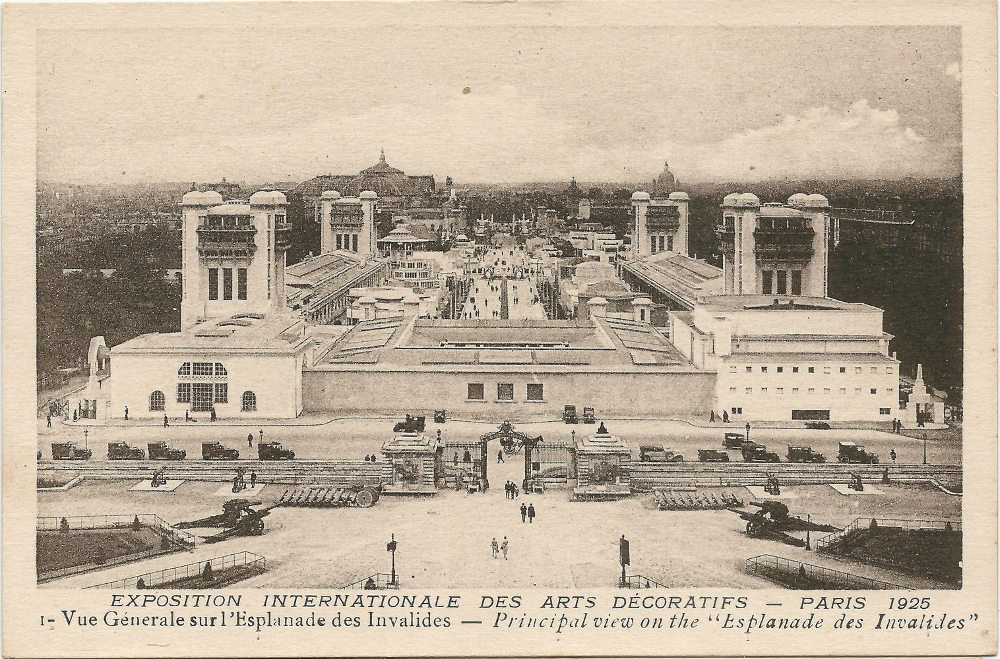
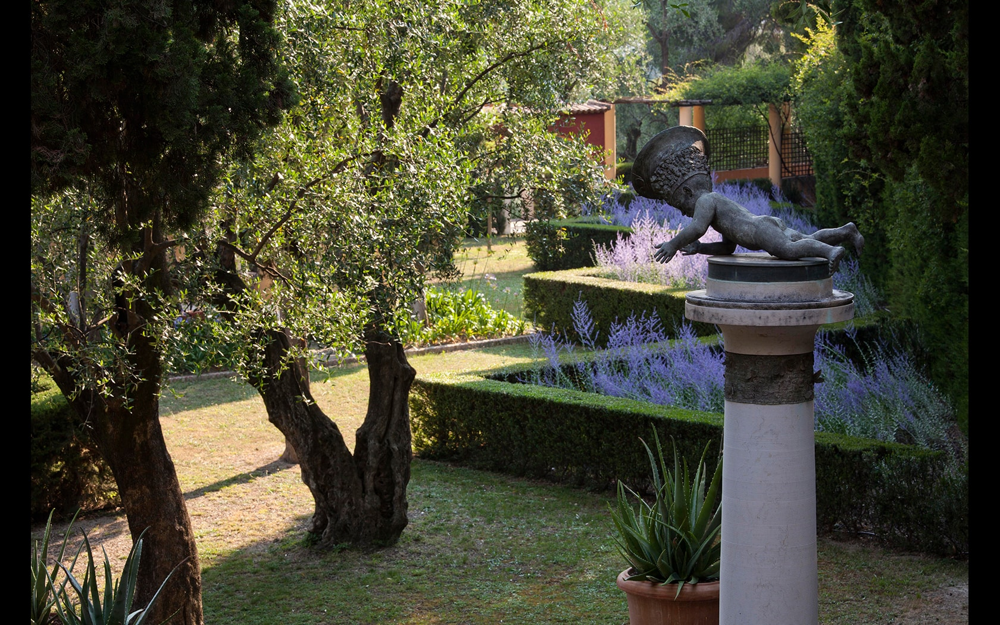
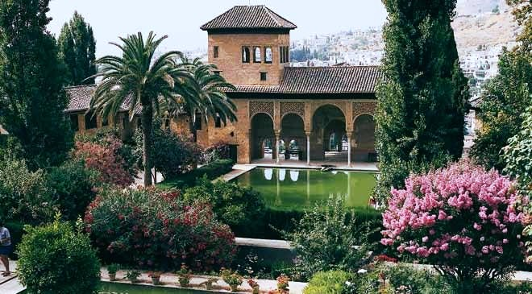
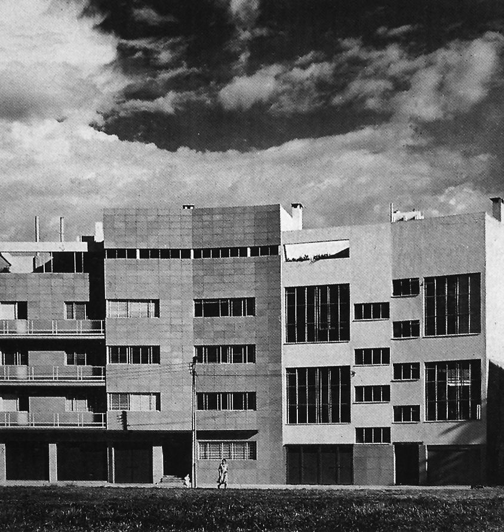
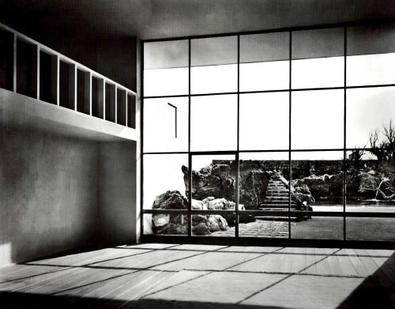
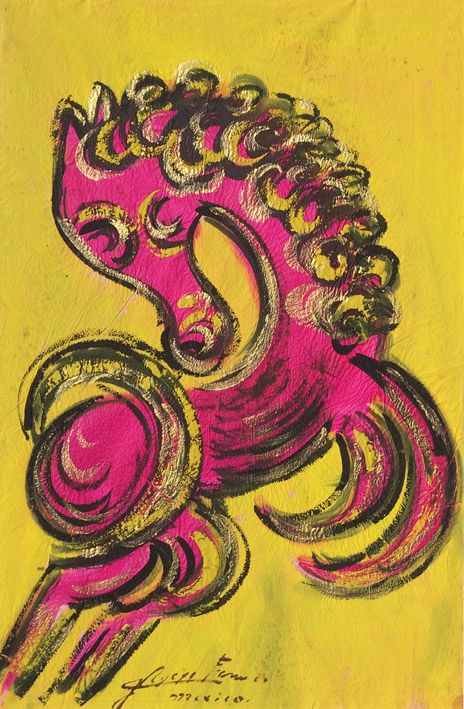
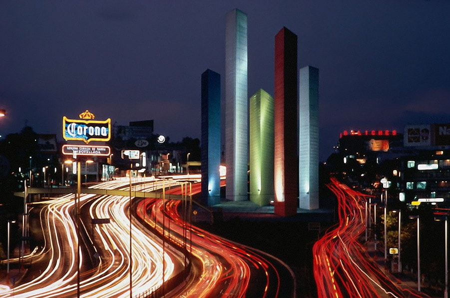
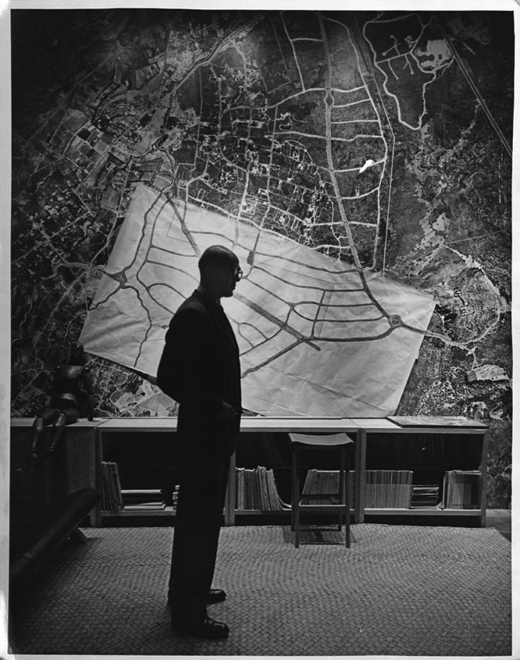
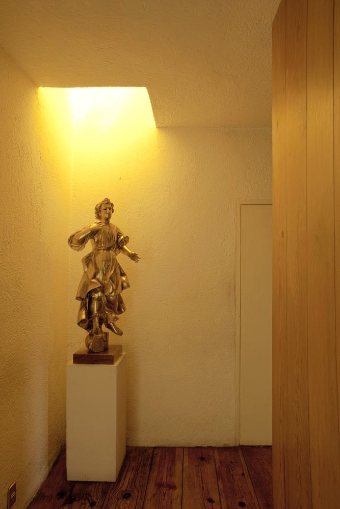
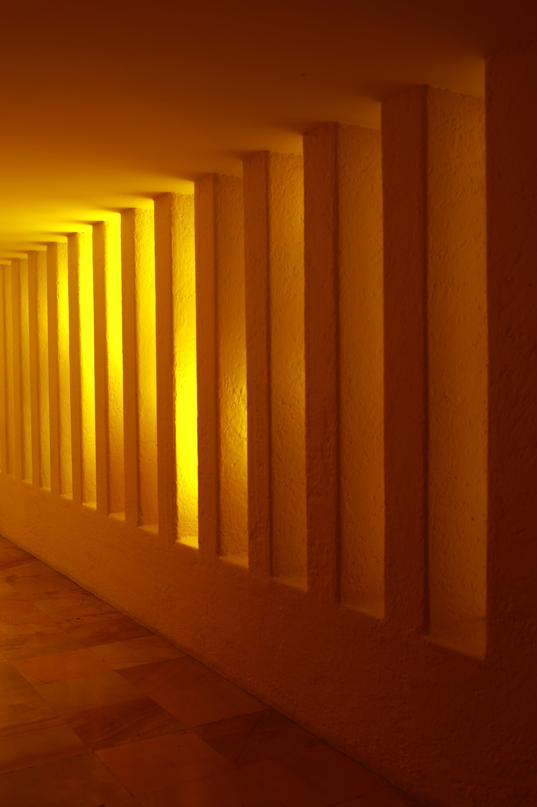

# Trayectoria e influencias

:::note info
***Durante el período de desarrollo urbano en México, surge la obra de Luis Barragán, que en un principio rechaza el estilo internacional, para luego adaptarlo y reinterpretarlo, encontrando su obra más elaborada en torno a la reflexión de la luz como materia en su arquitectura. La trayectoria de Barragán ejerce una influencia local en la arquitectura, y posteriormente, se globaliza gracias al reconocimiento inherente que constituye el premio Pritzker con el que fue galardonado en el año 1980 y supone la mayor distinción otorgada en el ámbito de la arquitectura.[^1]***

***En su obra, se observa la representación ajustada a los parámetros culturales de la identidad local en relación directa con el medio natural, además, asimila la valoración de distintas expresiones artísticas universales tales como la pintura, la escultura, la cultura arquitectónica y paisajística europea de la época.***

***El personaje de Barragán, resulta de interés en la presente investigación porque constituye un ejemplo universal del uso de la luz en su arquitectura, bajo la aplicación del color como medio expresivo, bañando los espacios matizados de luz reflejada, para crear atmósferas dentro de su arquitectura que invitan a la introspección y la calma.***
:::

> *El arte de Barragán es moderno pero no es modernista, es universal pero no es un reflejo de Nueva York o de Milán. Barragán ha construido casas y edificios que nos seducen por sus proporciones nobles y por su geometría serena; no menos hermosa -y más benéfica socialmente- es su arquitectura exterior, como él llama a las calles, muros, plazas, fuentes y jardines que ha trazado. La función social de estos conjuntos no está reñida con su finalidad espiritual. Los hombres modernos vivimos aislados y necesitamos reconstruir nuestra comunidad, rehacer los lazos que nos unen a nuestros semejantes; al mismo tiempo, debemos recobrar el viejo arte de saber quedarnos solos, el arte del recogimiento. Las plazas y arboledas de Barragán responden a esta doble necesidad; son lugares de encuentro y son sitios de apartamento.*
>
> **Octavio Paz**[^2]

<!--  -->

> **Figura 11:**
> *Luis Ramiro Barragán Morfín*.
> Guadalajara, Jalisco - México,
> (1902 - 1988).[^3]

Luis Ramiro Barragán Morfín, nace el 9 de marzo de 1902 en Guadalajara, Jalisco, México. En el seno de una familia acaudalada, culta y de principios religiosos. En 1919 inicia sus estudios profesionales en la Escuela Libre de Ingeniería en Guadalajara, en la cual era posible obtener el título de arquitecto en simultáneo con un curso anual suplementario. Sin embargo, en el año de su grado la posibilidad de esta doble titulación se ve suspendida, por lo que en 1923 se recibe únicamente de ingeniero civil.

## Primera Etapa

Realiza su primer viaje a Europa en 1925, visitando España y probablemente Italia, para luego trasladarse a Francia, justo cuando se llevaba a cabo en París, la *Exposition Internationale des Arts Déforatifs et Industriels Modernes*, evento importante en la arquitectura europea del momento por la participación de algunos arquitectos jóvenes como Frederic Kiesler, Le Corbusier y Konstantin Melnikov.

<!--  -->

> **Figura 12:**
> *Exposition Internationale des Arts Déforatifs et Industriels Modernes*.
> Paris - Francia,
> (1925).[^4]

Durante su viaje a Europa, tiene contacto con una influencia importante para su obra: la elaboración de los jardines diseñados por el arquitecto paisajista francés Ferdinand Bac, *Jardins Enchantés y Les Colombières*. La influencia de Bac, se observa en sus primeras obras de arquitectura a través del uso de jardines del estilo mediterráneo, combinado con elementos compositivos que toma prestados de esta arquitectura.

<!--  -->

> **Figura 13:**
> *El Jardín Casino en verano. Les Colombières"*.
> Menton - Francia,
> (1924).
> Ferdinand Bac.[^5]

:::note info
💡 De esta manera se desarrolla lo que se conoce como su primera etapa de creación arquitectónica, la cual consiste en emular sus influencias hasta la época, de allí que la *casa González Luna* (1929 - 1930), hace alusión a referentes europeos tradicionales, sin olvidar la adaptación propia de una arquitectura que emplea materiales locales para reflejar los métodos constructivos regionales.
:::

El uso de los jardines y fuentes, es referencia directa de Bac y el uso expresivo del agua, se ve influenciado por la implementación de los jardines de *la Alhambra* y del *Generalife* en Granada.[^6] La volumetría del edificio, la aplicación de los abocinamientos en los vanos de las ventanas, los detalles constructivos en los pasamanos y escaleras, son referencia directa a la arquitectura mediterránea.

<!--  -->

> **Figura 14:**
> *Jardin del Generalife*.
> Granada - España,
> Siglo XIV.[^7]

Los principios conceptuales de su primera obra, pertenecen a la llamada *Escuela Tapatía* cuya primera etapa de gestación transcurre en los años comprendidos entre 1927 y 1935, integrados por Luis Barragán, Rafael Urzúa y Alfonso Gutierrez Hermosillo. En esta época, la concepción arquitectónica se debatía entre la predominante influencia de las corrientes eclécticas del siglo XIX y la reciente convocatoria a una arquitectura funcionalista e internacional propuesta por *Le Corbusier* y su *esprit nouveau*. La arquitectura de la escuela, surge como reacción al movimiento de modernización de México en la época, rechazando el estilo internacional y aplicando una estética tradicional a las obras locales.[^8]

En los primeros proyectos de la Escuela Tapatía, se encuentra la influencia de la arquitectura mediterránea, norafricana y andaluza. Influencias que según advierte Barragán:

>*«...la belleza de la arquitectura islámica reside en el hecho de que dos extremos se tocan: el misterio de la religión y la magia de la sensualidad, casi del erotismo.»*[^9]

:::note info
💡 De esta primera etapa de la obra de Barragán (1927 - 1934), también se producen la renovación de la *casa Robles León*, la *casa Aguilar* y la *casa Cristo*.
:::

## Segunda Etapa

Luego de un viaje a Nueva York en febrero de 1931, donde conecta con la obra del muralista mexicano José Clemente Orozco, y de su segundo viaje a Europa, se ve impregnado de la influencia de la arquitectura moderna; y en 1934 al regresar a México, se producen las obras consideradas de su *segunda etapa de creación* (1935 - 1940).

> *«Antes de realizar este segundo viaje que duraría de 1931 a 1932, Barragán era totalmente fiel al movimiento regionalista que él había iniciado. Las tres últimas obras que realizó antes de partir son la Casa González Luna, la Casa Franco y la Casa Cristo. Y algo es evidente en ellas, la ornamentación está por todos lados. Las texturas, las formas, los materiales, la vegetación, el agua, los colores expresan en su nivel más alto esa ya tan conocida influencia y sincretismo entre la arquitectura vernacular de Jalisco, los dibujos de Ferdinand Bac y la arquitectura islámica. (...) Barragán nunca abandonó realmente al cien por ciento sus mayores influencias, simplemente las depuraba, estilizaba y las perfeccionaba. De ahí que en su obra madura podamos apreciar la penumbra, la simplicidad, los jardines, el agua, el sonido y demás elementos característicos.»*
>
> Coolhuntermx.[^10]

:::note info
💡 Las obras de esta etapa, se ven identificadas por el empleo del estilo internacional en todos sus edificios, estos, con la finalidad de satisfacer intereses económicos personales a la vez de depurar su ejecución de la arquitectura desprendiéndose en gran parte del elemento ornamental, emulando los principios funcionalistas de la arquitectura moderna, sin agregar gran valor estético a la expresión de las obras. Destaca la calidad de construcción de los elementos arquitectónicos y del empleo de las nuevas técnicas de construcción de la época. Poco se puede adjudicar a su desarrollo de la expresividad plástica del color y la luz en su arquitectura, a través de las obras de esta etapa, aunque si se podría asociar la influencia de Le Corbusier en los criterios de diseño de los edificios.
:::

Se hace mención especial al edificio realizado con el arquitecto Max Cetto, donde proyectan cuatro estudios para pintores, con ventanales de piso a techo en los talleres de doble altura, en especial cuidado a las demandas que el oficio requiere.

<!--  -->
> **Figura 15:**
> *Edificio estudio para pintores*.
> Plaza Melchor Ocampo, Colonia Cuauhtémoc,
> Ciudad de México - México,
> (1936-1940).
> Max Cetto y Luis Barragán.[^11]

<!--  -->

> **Figura 16:**
> *La estancia de una Casa de la Muestra*,
> Jardines del Pedregal,
> Ciudad de México - México,
> (1950).
> Max Cetto y Luis Barragán.[^12]

## Tercera Etapa

:::note info
💡 Luego de este período, Barragán especula un tiempo con la adquisición y venta de bienes raíces, actividad que le permite su dedicación a la renovada reflexión en torno a los jardines. Posteriormente, se dedica de manera exclusiva a la producción de los mismos, dotándose de la fuerza creadora, que le permite en adelante adentrarse en su *tercera etapa de creación arquitectónica*. Cuyos efectos, se encuentran más relevantes a juicio de la presente investigación.
:::

La construcción de su propia casa, le otorga la posibilidad de demostrar su experiencia, siendo objeto de constantes renovaciones y modificaciones. Refina su sensibilidad estética y permite vislumbrar las intenciones de la arquitectura de su etapa más creativa. Una nueva influencia se implementa en su aparato creativo, la de su amigo pintor *Jesús Reyes Ferreira, «Chucho Reyes»*, de quien se inspira Barragán en su sensibilidad por el uso del color.[^13]

<!--  -->

> **Figura 17:**
> *Caballo Rosa*,
> México,
> (S/F).
> Chucho Reyes.[^14]

:::note info
💡 Una característica de las residencias realizadas por el arquitecto en su tercera etapa creativa, es la de producir arquitectura en torno a los ideales funcionalistas, con una configuración topológica que permite la orientación del usuario hacia el interior de la vivienda, realizando escasas perforaciones hacia el espacio público y abriendo patios internos para la apropiación completa del espacio. Generalmente, los cerramientos exteriores se componen de sendos muros con espesor considerable para amortiguar la mayor cantidad de ruido externo.
:::

Por otra parte, en su incursión hacia las intervenciones urbanas, establece temporalmente una amistad con el artista *Mathias Goeritz*, quien constituye una influencia en el desarrollo de su sensibilidad artística. Culminando en la elaboración conjunta de de la escultura urbana de las *Torres de Satélite*, construidas en el año 1957. Esta obra, le permite la reflexión en torno al uso de las figuras geométricas simples en su arquitectura y el empleo del color como recubrimiento, que interactúa de forma directa con la luz y la sombra.

<!--  -->

> **Figura 18:**
> *Torres de Satélite*.
> Ciudad Satélite, Naucalpan de Juárez,
> Ciudad de México - México,
> (1957 - 1958).
> Luis Barragán y Mathias Goeritz.[^15]

:::note info
💡 En este momento, Barragán es un personaje con solvencia económica, lo cual le permite la selectividad de los proyectos en los que se ve involucrado. Apropiándose de una libertad creadora, que nace mas allá de los intereses materiales. De aquí en adelante, el manejo de la luz es su instrumento fundamental de trabajo, buscando la emotividad dentro de sus creaciones.
:::

Comenzando la experiencia de la construcción de su residencia, experimenta con la creación de jardines por un tiempo, dedicando gran parte de su energía a ello. Ejecuta cuatro jardines en Tacubaya, en terrenos propios y tres más en el *Pedregal de San Ángel*. Este período de dedicación al al paisajismo, le otorga la experiencia para la utilización de la naturaleza en sus obras.

<!--  -->

> **Figura 19:**
> *Proyecto del Pedregal de San Angel*.
> (1945).
> Luis Barragán.[^16]

Los terrenos situados en El Cabrío, ubicados en los límites de El Pedregal, se encontraban en venta para el momento. Barragán se asocia en el año 1945 con *José Bustamante*, para la adquisición de estas tierras, enfrentándose al proyecto urbanístico más relevante de su carrera.

El Cabrío se compone de una topografía accidentada, dotada de un terreno compuesto de piedras volcánicas y pequeñas corrientes de agua natural, que componen una zona donde solo cierto tipo de vegetación se adapta al ecosistema; esto le permite la experimentación con un nuevo tipo de jardín compuesto de espejos de agua natural, el uso de macetas y vegetación propia de la árida topografía.

La vialidad implementada, consigue adaptarse a las formas propias de la zona, y la división de las parcelas, se hace a través de muros de piedra volcánica, adaptándose en varios sentidos al terreno, utilizando los materiales propios del lugar, en provecho de una planificación urbana que se sincroniza con su entorno.

Cinco años después de la adquisición de las tierras en 1950, el desarrollo urbano de la Ciudad Universitaria en terrenos adyacentes, propiciaría el éxito comercial de la zona. De esta forma, ocurre una coincidencia histórica, el creciente desarrollo urbano que sucede en México para la época, constituye la consolidación y viabilidad económica del desarrollo urbano en El Cabrío.

En el año 1948, en el terreno contiguo a la casa Barragán-Ortega, Barragán emprende la construcción de su nueva residencia. La misma, se puede identificar a nivel formal con una identidad moderna aunque utiliza materiales locales para su ejecución. Además, la obra ha manifestado constantes remodelaciones por parte del arquitecto, en pro de encontrar la paz y tranquilidad que tanto anhela en la búsqueda de habitar su espacio personal.

Destacan el uso del color como un elemento compositivo esencial, el apego a las formas puras en la arquitectura y el empleo de la luz para darle identidad a los espacios.

<!--  -->

> **Figura 20:**
> *La luz como elemento compositivo del espacio*.
> Casa Estudio,
> Ciudad de México - México,
> (1948).
> Luis Barragán.

Continúa esta etapa creativa, con la construcción de nuevos proyectos. En el año 1953, inicia el proyecto de la *Capilla de Tlalpan*, en el convento de las monjas Capuchinas Sacramentarias, finalizada en el año 1960.

A continuación, la *casa Gilardi*, construida entre 1975 y 1977, constituye su obra maestra. El espacio se distribuye alrededor de un patio central que alberga un gran árbol de Jacaranda en uno de sus bordes, casi se puede decir que es un espacio dedicado a la contemplación del cielo, ya que se despoja de elementos construidos, en las inmediaciones del patio.

<!--  -->

> **Figura 21:**
> La integración de la luz es una constante en la obra de Barragán.
>
> *Casa Gilardi*,
> Ciudad de México - México,
> (1975-1978).
> Luis Barragán.

La arquitectura de Barragán resulta representativa, debido a que su búsqueda arquitectónica se refleja como un arte que encierra diversas perspectivas simultáneas, tomando en cuenta valores culturales, el entorno natural, la manipulación del color y la luz, desencadenando una intensa experiencia de emociones por parte de quien aprecia su obra; en este sentido, establece un arte de calidad universal, merecedora del mayor galardón otorgado a los arquitectos del mundo, el *Premio Pritzker*, obtenido en el año 1980.

<!-- Por hacer: Colocar referencia de la página del pritzker. -->

[^1]: Según **(Vázquez Ángeles, 2014)**, en referencia a la obra *The new mexican architecture* por *Ester Born* editada en 1937, quien tuvo la oportunidad de ayudar a visibilizar la obra de Barragán en Estados Unidos, lo retrata con la siguientes declaraciones: *«Una nota encantadora de capricho y diversión en contraste con la sencilla arquitectura ha sido dada por el inteligente uso del color en todos los edificios. Luis Barragán, el más joven del grupo, ha sido exitoso en su imaginativo uso del color en la arquitectura moderna. Su natural y sensible percepción estética nunca ha encontrado satisfacción en la restricción de la paleta popularmente asociada con el estilo internacional.»*

[^2]: **Paz, O. (2010, septiembre 1).** Luis Barragán, por Octavio Paz. De la revista Vuelta en el volumen de Junio de 1980. Javier Eder. *Enlace:* https://www.edder.org/?p=969

[^3]: **Luis Barragán. (2021).** En Wikipedia, la enciclopedia libre. *Enlace:* https://es.wikipedia.org/w/index.php?title=Luis_Barrag%C3%A1n&oldid=135515295

[^4]: **Fiederer, L. (2016, agosto 19).** AD Classics: Exposition Internationale des Arts Décoratifs et Industriels Modernes / Various Architects. ArchDaily. *Enlace:* https://www.archdaily.com/793367/ad-classics-exposition-internationale-des-arts-decoratifs-et-industriels-modernes

[^5]: **Bac, F. (1924).** Les Colombières. Pinterest. *Enlace:* https://www.pinterest.com/pin/900719994193917589

[^6]: Según **(Itinerario Barragán, 2020)**, *«Desde una etapa temprana Barragán tuvo un acercamiento al mundo del paisaje, primero con los libros Les Colombières y Jardins Enchantés, ambos escritos e ilustrados por el arquitecto francés Ferdinand Bac. Más adelante visitaría la Alhambra, en este sitio Barragán se cautivó por la belleza de los jardines del Generalife y el Patio de los Leones. (...) El 18 de agosto de 1972 se funda la Sociedad de Arquitectos Paisajistas de México, A.C. con los arquitectos Carlos Contreras Pagés, Jesús Salvador Pozada Barnard, Gerardo Ibarra Gómez, Alfonso Quiles Gómez, Roberto Rubio Culebro, Eliseo Arredondo González, Alfonso Muray Kobory, Carlos Bernal Salinas, Mario Schjetnan Garduño, Esperanza María Salum y se designa a Luis Barragán como presidente honorario vitalicio.»*

[^7]: **Ribelles, C. (2017).** Jardines del Generalife en la Alhambra de Granada. Pinterest. *Enlace:* https://www.pinterest.es/pin/368521181986750731/

[^8]: **González Gortázar, F., & Palomar Verea, J. (2004).** Los fundadores de la Escuela Tapatía. En La arquitectura mexicana en el siglo XX (pp. 276-278). CONACULTA.

[^9]: **Shjetnan, M., & Barragán, L. (1999).** El mundo de Luis Barragán. Entrevista a Luis Barragán. En Conversación de formas (p. 61).

[^10]: **Lozano, D. (2019, octubre 25).** La evolución de Luis Barragán. Coolhuntermx. *Enlace:* https://coolhuntermx.com/la-evolucion-de-luis-barragan-guadalajara-arquitectura-mexicana/

[^11]: **Barragán, L., & Cetto, M. (2012).** Edificio de estudio para artistas. Una Vida Moderna. Mid Century Modernism in Mexico & Detroit. *Enlace:* https://unavidamoderna.tumblr.com/post/37313580450/icaronycteris-luis-barrag%C3%A1n-edificio-de

[^12]: **Barragán, L., & Cetto, M. (2013).** La estancia de una Casa de la Muestra en Fuentes 140, Jardines del Pedregal. Una Vida Moderna. Mid Century Modernism in Mexico & Detroit. *Enlace:* https://unavidamoderna.tumblr.com/post/68199662369/la-estancia-de-una-casa-de-la-muestra-en-fuentes

[^13]: Según **(Noelle, 1996)**, *«Además, en diversas ocasiones, este artista colaboró con Barragán como asesor y consejero, sobre todo en la aplicación de colores en los muros, así como la inclusión de elementos decorativos de origen popular. (...) Se puede decir que esta relación reforzó en Barragán su afición por los elementos locales, sobre todo los de la zona de Jalisco, a la vez que le permitió experimentar con texturas diferentes y un colorido cada vez más amplio.»*

[^14]: **Reyes Ferreira, J. (S/F).** Caballo Rosa. Galería Inverarte. *Enlace:* https://www.inverarteartgallery.com/artist/chucho-reyes/painting/pink-horse/

[^15]: **Duque, K. (2012, octubre 21).** Clásicos de Arquitectura: Torres de Satélite, Luis Barragán. ArchDaily México. https://www.archdaily.mx/mx/02-200590/clasicos-de-arquitectura-torres-de-satelite-luis-barragan

[^16]: **Arquine. (2013).** Barragán. *Enlace:* https://i0.wp.com/www.arquine.com/wp-content/uploads/2013/03/amc_17320_a_3001.jpg
