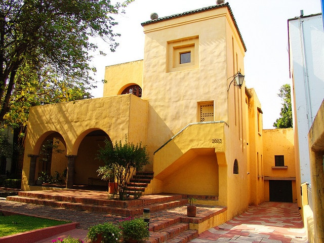
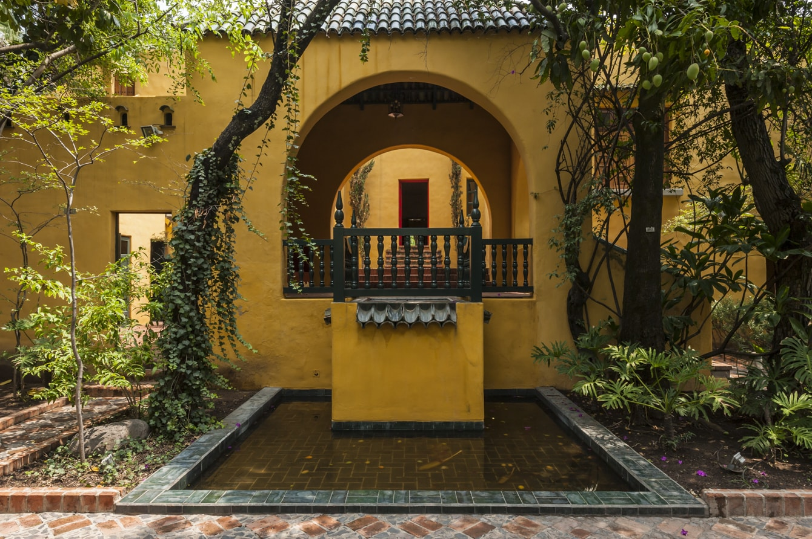
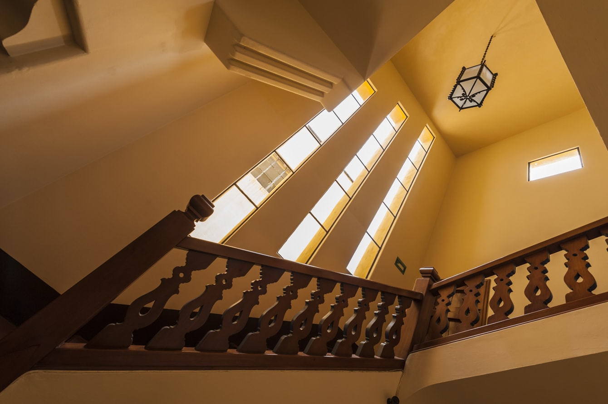

# Casa González Luna

:::note info
***Durante su primer período de creación arquitectónica, en 1929 Barragán recibe el encargo de realizar una casa para el ideólogo, político e intelectual Efraín González Luna. Se considera que la pieza, pertenece a la Escuela Tapatía de arquitectura, cuya premisa consiste en la apropiación de la identidad cultural, adaptada a la arquitectura y el rechazo a la corriente funcionalista que trae consigo la llegada de la modernidad a la región.***
:::

> "Creo que los arquitectos deberían diseñar jardines para ser usados, tanto como las casas que construyen, para desarrollar un sentido de la belleza y del gusto e inclinación hacia las finas artes y otros valores espirituales... Cualquier trabajo de arquitectura que no expresa serenidad es un error."
>
> Tomado de [The Pritzker Architecture Prize](https://www.pritzkerprize.com/laureates/1980),
> (1980).
>
> Luis Barragán.

<!-- PorHacer: Colocar el enlace a pie de pagina, año persona, pagina -->

<!--  -->

> **Figura 22:**
> *Casa González Luna*.
> Guadalajara - México,
> (1929 - 1930).
> Luis Barragán.[^1]

La parcela que apropia el proyecto se encuentra ubicada en la ciudad de Guadalajara en Jalisco - México, emplazada en una parcela de 1750 m2. Destaca de sus condiciones de emplazamiento, el hecho de que frente y fondo de la parcela están limitadas por una calle y una avenida, que le permite a Barragán articular un doble acceso en la fachada principal y trasera de la vivienda.

En cuanto al ámbito formal compositivo, destaca la influencia por la arquitectura mediterránea que absorbió durante su primer viaje a Europa, en especial, el conocimiento adquirido al tener contacto con la obra de jardinería de Ferdinand Bac, generando una combinación simbiótica del edificio con la naturaleza, mediante el uso de jardines y fuentes de forma deliberada para rodear a los habitantes de la vivienda del elemento natural y de sus sonidos característicos. También incluye, el uso de estares intermedios que fungen como umbrales y áreas sociales de la vivienda para aprovechar los jardines.

<!--  -->

> **Figura 23:**
> *Fuente y entorno natural de la Casa González Luna*.
> Guadalajara - México,
> (1929 - 1930).
> Luis Barragán.[^2]

El aspecto estilístico del edificio hace referencia directa a la arquitectura del sur de España, aplicando el uso de elementos estructurales del estilo, de esta forma, se emplean arcadas en los estares exteriores que actúan como área social y elemento de umbral entre el interior y el exterior de la vivienda; además, en el nivel superior, se construyen terrazas al aire libre. En cuanto a elementos compositivos, se aprecian los abocinamientos en las ventanas y el énfasis a los accesos del volumen privado, a través del contraste que genera la pintura de colores llamativos en las puertas exteriores.

<!-- PorHacer: Colocar una planta de la edificación -->

En esta construcción, se aprecia un uso puntual del elemento del color, aplicado a las superficies del edificio. Se podrían empezar a asociar los intereses de Barragán por la aplicación del color en su arquitectura, como un elemento integrador de los espacios generados.

<!-- PorHacer: Este párrafo colocarlo a pié de pagina como referencia al anterior -->

En el núcleo de circulación vertical de la vivienda, el empleo de estrechos ventanales uniformizan la cualidad de la luz incidente, de esta forma, a lo largo del día se experimenta una incidencia de luz continua que cumple una doble función, la de orientar al que transita por las escaleras y exponer los detalles constructivos que unifican la composición del edificio.

<!--  -->

> **Figura 24:**
> *Núcleo de circulación vertical de la Casa González Luna*.
> Guadalajara - México,
> (1929 - 1930).
> Luis Barragán.[^3]

La aplicación de materiales locales en la construcción, como las paredes de adobe, piedra y ladrillo, propician la estabilidad térmica del edificio en el interior; asimismo, el uso de muros exteriores de considerable espesor, contribuyen a un aislamiento acústico que establece uno de los intereses concurrentes por parte de Barragán a la hora de realizar arquitectura residencial. La búsqueda de una arquitectura donde la introspección y el silencio sean acompañantes indispensables de quién la habita.

:::info aspectos destacados
Los baños de luz dentro del edificio y la incorporación de la naturaleza, son esenciales para darle sentido a esta obra, vislumbrándose de forma concreta el germen que pone en evidencia las inquietudes del arquitecto, buscando la integración sensorial en su arquitectura.

Destaca el uso del jardín como una herramienta de composición arquitectónica, que busca complentar la experiencia espacial del usuario, con los elementos propios de la naturaleza. En este caso, el jardín y la vivienda se entienden como una obra en conjunto.
:::

[^1]: **Barragán, L. (2016).** Casa González Luna. WikiArquitectura. *Enlace:* https://es.wikiarquitectura.com/edificio/casa-gonzalez-luna/

[^2]: **Barragán, L. (2016).** Casa González Luna. Novotop. *Enlace:* https://i1.wp.com/egarq.files.wordpress.com/2016/07/architecture-photography-guadalajara-colonia-lafayette-casa-iteso-clavigero-luis-barragan-fotografia-arquitectura_ega7435.jpg

[^3]: **Barragán, L. (2016).** Casa González Luna. WikiArquitectura. *Enlace:* https://es.wikiarquitectura.com/edificio/casa-gonzalez-luna/

