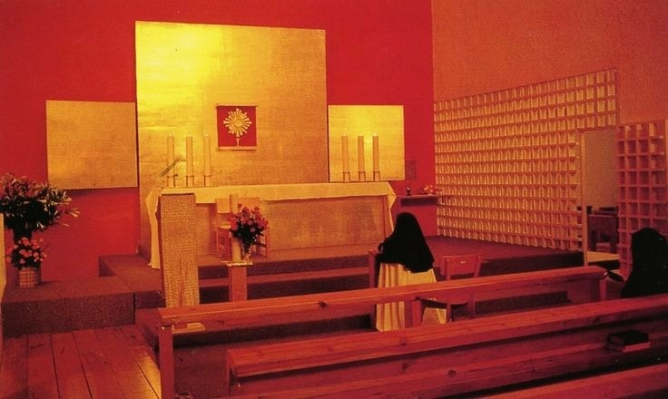
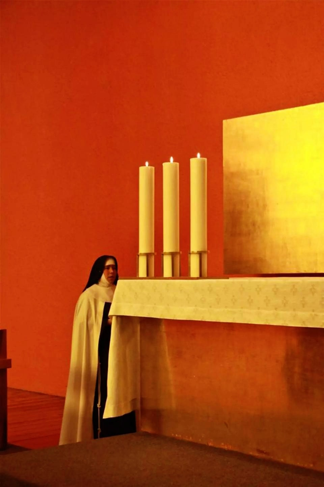
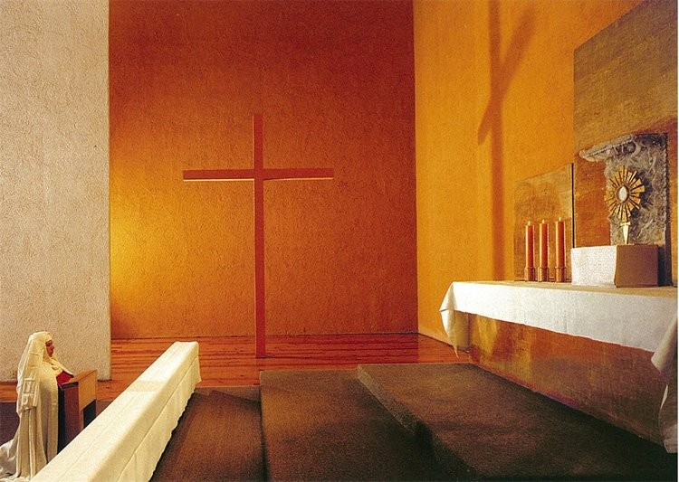
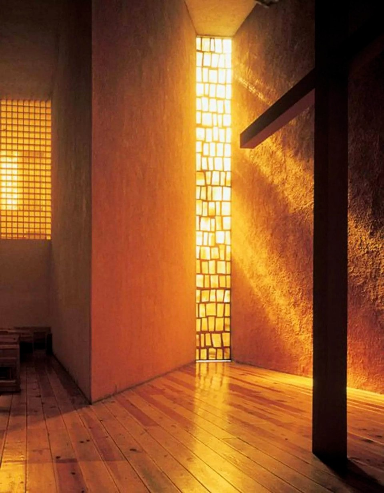
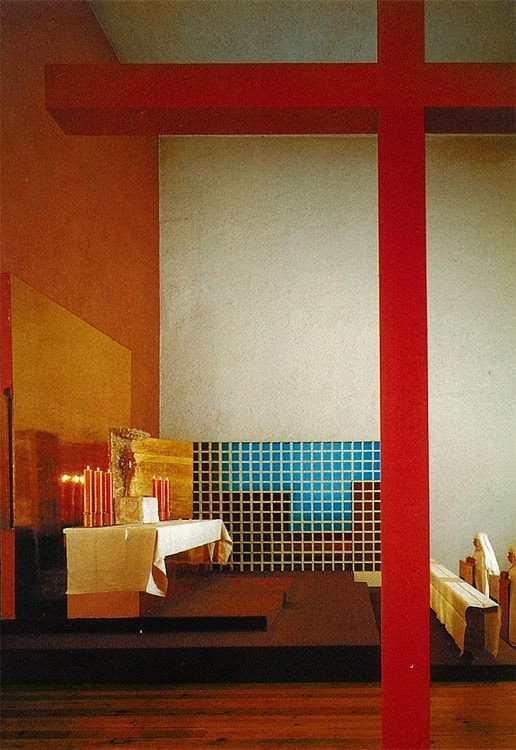

# Capilla de las Capuchinas Sacramentarias

La Capilla del Monasterio de Las Clarisas Capuchinas Sacramentarias, ubicada en Tlalpan y realizada por Luis Barragán desde 1952 hasta su inauguración en 1960. Consiste en un edificio diseñado como respuesta a una vida piadosa. Por su manipulación de las características de la luz incidente, otorga un espacio de atmósferas variables, de acuerdo al momento en que el observador la experimenta.

<!--  -->

> **Figura 25:**
> *Capilla de las Capuchinas Sacramentarias*.
> Tlalpan, Ciudad de México - México,
> (1952-1960).
> Luis Barragán.

El espacio interno formalmente de trazos limpios, se configura de tal manera, que el recinto otorga la mayor privacidad posible al ocupante de la nave del templo y en contraste, esta moderación formal, se ve matizada con la manipulación de las características de la luz, producido por las diversas entradas y materiales que dejan pasar el elemento constructivo más importante de la obra.

<!--  -->

> El empleo de las formas simples y la manipulación de las características luz eleva de categoría el recinto.

<!-- PorHacer: colocar esta leyenda a pié de página -->

> **Figura 26:**
> *Capilla de las Capuchinas Sacramentarias*.
> Tlalpan, Ciudad de México - México,
> (1952-1960).
> Luis Barragán.

La Capilla resulta de vital interés porque Barragán a través de ella, emplea diversas técnicas de captación de la luz, para teñir una atmósfera variable a lo largo del día, elevando la cualidad de la luz a la altura del templo. De esta manera, elementos centrales en la composición como la cruz, se ubica a un costado de la nave principal, captando la luz filtrada a través de un cristal translúcido teñido de dorado, para proyectar su sombra sobre el altar durante la mañana.

<!--  -->

> La materialización del símbolo religioso de la cruz, se logra con la proyección de su sombra sobre la superficie que contiene el altar.

<!-- PorHacer: colocar esta leyenda a pié de página -->

> **Figura 27:**
> *Capilla de las Capuchinas Sacramentarias*.
> Tlalpan, Ciudad de México - México,
> (1952-1960).
> Luis Barragán.

El tono rosa y amarillo de los paramentos, bañan de su reflejo la totalidad del recinto al estar en contacto con la luz, además de componer celosías en los muros laterales de la nave para filtrar la incidencia luminosa reflejada en el pavimento, de esta manera, otorgar un mayor grado de luminosidad en el recinto, con el motivo de poner en valor a la luz en el espacio desarrollado en la penumbra.

<!--  -->

> **Figura 28:**
> Filtrado de la luz con cristales tintados.
>  
> *Capilla de las Capuchinas Sacramentarias*.
> Tlalpan, Ciudad de México - México,
> (1952-1960).
> Luis Barragán.

En las áreas exteriores de transición, la sensación de privacidad y el aislamiento acústico en el interior de la capilla, se mantiene gracias a que el perímetro se rodea de altos y gruesos muros que delimitan el patio; complementándose con árboles de trinitarias.

<!--  -->

> **Figura 29:**
> Uso de celosías laterales para la captación de luz indirecta.
>
> *Capilla de las Capuchinas Sacramentarias*,
> Tlalpan, Ciudad de México - México,
> (1952-1960).
> Luis Barragán.

<!-- PorHacer: aspectos destacados -->

:::info aspectos destacados
En la presente obra, destaca la composición en planta que ubica los vanos en el muro de manera intencionada, tomando en cuenta las interacciones entre luz y sombra para generar un efecto simbólico en el recinto arquitectónico. Además, las cualidades del medio refractivo de la ventana, se modifica para tintar la atmósfera interna del espacio visual.
:::
