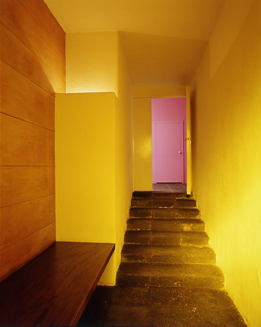
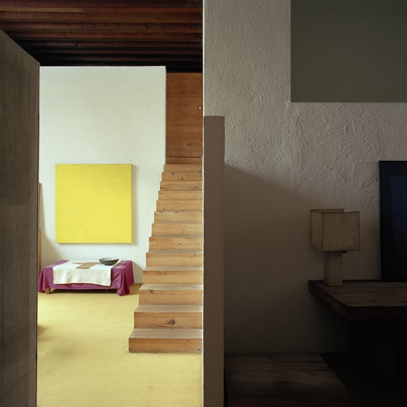
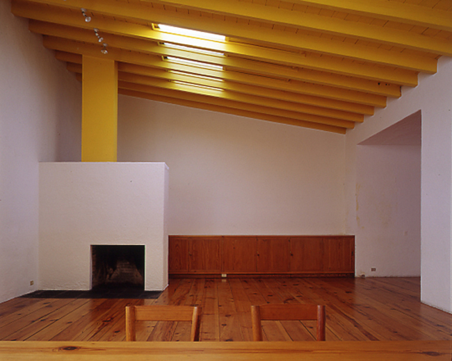
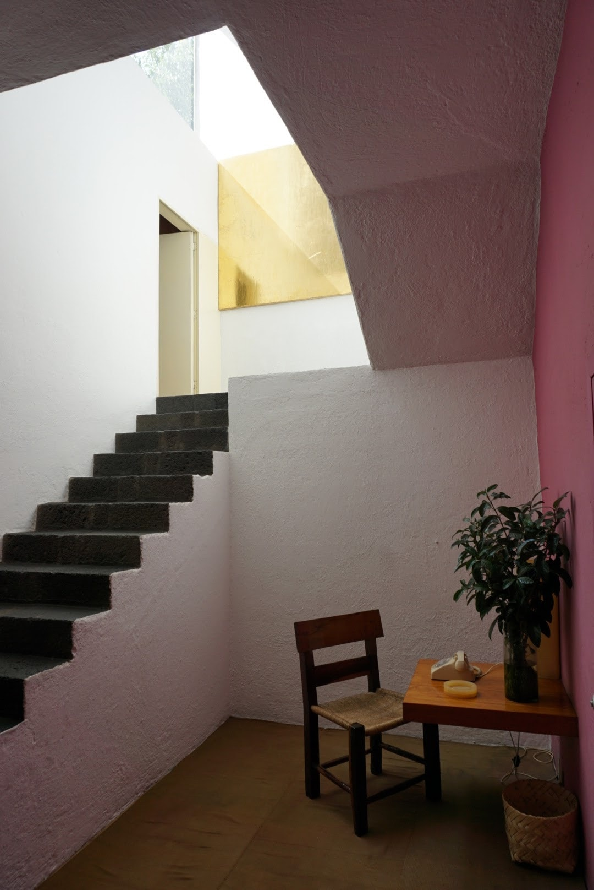
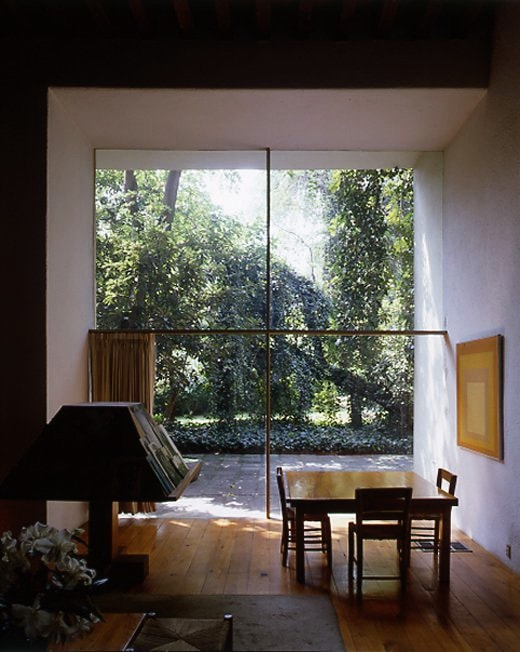
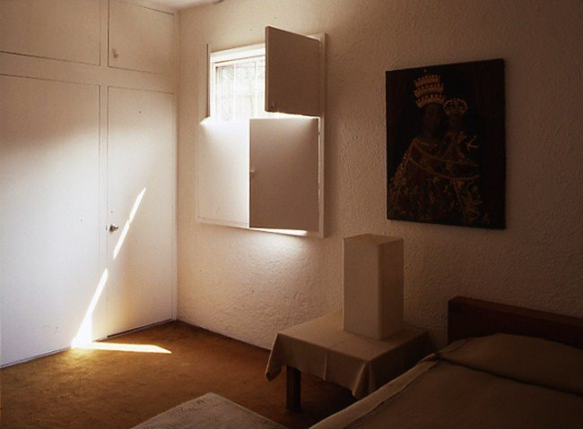
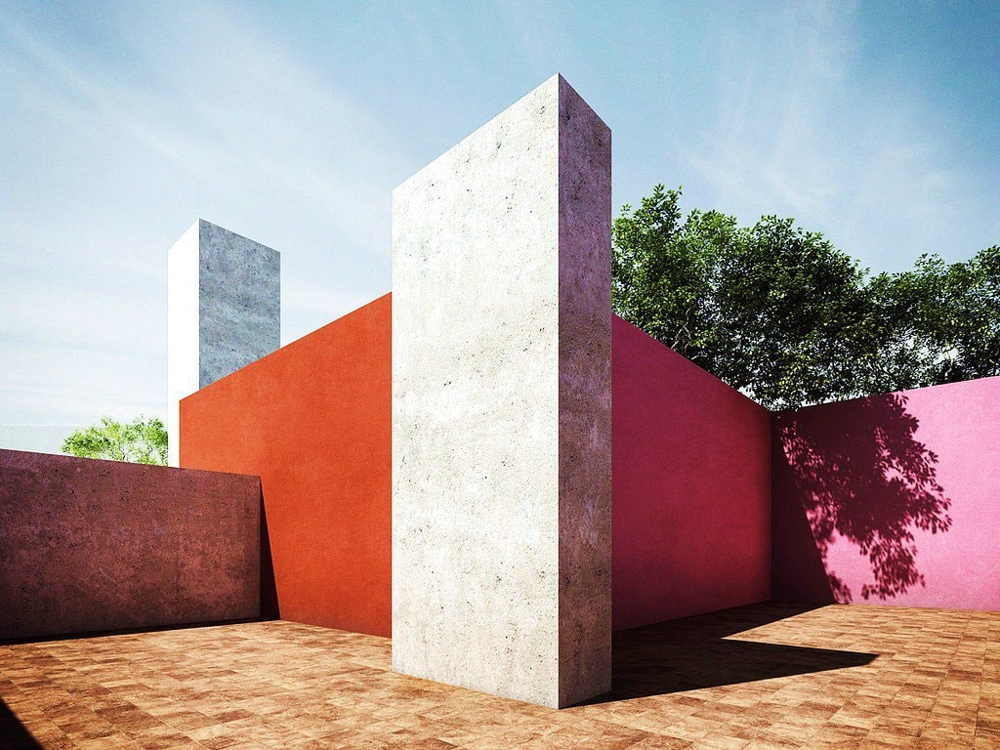

# Casa estudio de Luis Barragán

:::note info
***Barragán influyó de forma significativa en la arquitectura mexicana, al lograr que varios de sus edificios se convirtieran posteriormente en íconos de la identidad nacional. La casa estudio de Barragán, constituye un ejemplo que resume y sintetiza su sensibilidad y criterio aplicado a la creación arquitectónica.***
:::

<!--  -->

> **Figura 30:**
> Corredor de acceso principal a la Casa Estudio.
>
> *Casa estudio*,
> Ciudad de México - México,
> (1948).
> Luis Barragán.

A partir del año 1947, en paralelo con la primera etapa del desarrollo urbano en los jardines del Pedregal, comienza la construcción de su casa estudio, contando con una estética exterior austera, para adaptarse a los criterios urbanos pertenecientes al barrio de Tacubaya en Ciudad de México, donde se emplaza. La casa se convierte en el campo de experimentación de su pensamiento, tomando en cuenta factores que definen su estilo presentes en su obra tardía: el uso del color, el manejo de la luz, la adaptación de los espacios de acuerdo al recorrido y los principios de privacidad aplicados a la obra.

<!-- Colocar planos de planta de la vivienda -->

La vivienda se desarrolla y se remodela en repetidas ocasiones para adaptarse a las necesidades del arquitecto con el paso del tiempo, por lo que su fecha de finalización resulta alrededor de la década de los sesenta. Uno de los criterios adoptados en función del recorrido a su casa estudio, se le atribuye a la aplicación del concepto de Raumplan, propuesto inicialmente por el arquitecto Adolf Loos.

> Mi arquitectura no se concibe en planos, sino en espacios (cubos). No diseño planos de planta, fachadas, secciones. Diseño espacios. Para mí no hay planta baja, primer piso, etc. ... Para mí, solo hay espacios contiguos, continuos, salas, antesalas, terrazas, etc. Las plantas se fusionan y los espacios se relacionan entre sí. Cada espacio, requiere una altura diferente: el comedor seguramente es más alto que la despensa, por lo que los techos se colocan en diferentes niveles. Unir estos espacios de tal manera que el ascenso y la caída no solo sean inobservables sino también prácticos, en esto veo lo que para otros es el gran secreto, aunque para mí es una gran cuestión de curso.
>
> Adolf Loos sobre el concepto de *Raumplan*

<!-- PorHacer: año y de donde se sacó este contenido pagina y número -->

<!--  -->

> **Figura 31:**
> Desarrollo espacial en el interior de la vivienda.
>
> *Casa estudio*,
> Ciudad de México - México,
> (1948).
> Luis Barragán.

La aplicación de este concepto, no solamente se observa en las secuencias espaciales de la vivienda y en el sentido del recorrido que aplica al contraer y extender el espacio de manera rítmica, sino que también utiliza los planos superiores e inferiores del volumen como un tema de especial cuidado en la composición, lo que podemos ver en la aplicación del color en los elementos de la cubierta o eventualmente en la apertura de vanos sobre estrechos pasillos, para hacer énfasis en las pinturas o esculturas que apropia y ubica de forma estratégica como si de una exposición de arte se tratase dentro de la vivienda.

<!--  -->

> **Figura 32:**
> El plano superior como elemento integrador del espacio.
>
> *Casa Estudio*,
> Ciudad de México - México,
> (1948).
> Luis Barragán.

El oficio de Barragán al generar arquitectura residencial, consiste en el aprendizaje y el entendimiento del día a día de sus residentes, cuyas necesidades, se materializan en un edificio que alberga las condiciones requeridas para su uso y que a su vez, busca evocar el estilo de vida tradicional mexicano en un asentamiento bajo premisas contemporáneas. Por esto, vemos un desarrollo espacial acorde al arte contemporáneo en su arquitectura y a su vez, surge una sensibilidad por la integración plástica entre la artesanía, la pintura, los tejidos y una variada paleta de colores que compaginan con el dictamen de la tradición mexicana. Por lo tanto, la casa estudio de Barragán supone la fusión de composición espacial, generación de atmósferas a través de los elementos decorativos y los colores de las superficies, en especial, la manipulación de las características de la luz.

<!--  -->

<!-- PorHacer: nota a pié de página y colocar en la descripción que área es esa -->
> **Figura 33:**
> La geometría de la vivienda aprovecha el recurso de la luz para enriquecer el espacio.
> 
> *Casa Estudio*,
> Ciudad de México - México,
> (1948).
> Luis Barragán.

Por otra parte, el elemento ventana ubicado en la sala-comedor de la vivienda, hace un vínculo directo entre el interior y exterior, sensibilizando al hombre con un tema recurrente en la adaptación de los espacios a la naturaleza.

<!--  -->

> **Figura 34:**
> Integración espacial entre el interior y exterior de la vivienda.
>
> *Casa Estudio*,
> Ciudad de México - México,
> (1948).
> Luis Barragán.

Así, la consecución de espacios que supone el recorrido, la extensión o contracción de la escala, la apertura hacia la naturaleza o la introspección hacia los dominios privados de la vivienda, junto con la experimentación de elementos visuales como el color y la luz, resultan en un enriquecimiento sensorial por parte de Barragán, abarcando los factores que consolidan sus principios de composición arquitectónica.

<!--  -->

> **Figura 35:**
> *Casa Estudio*,
> Ciudad de México - México,
> (1948).
> Luis Barragán.

Eventualmente, la vivienda de Barragán se caracteriza por desarrollar un patio superior con doble funcionalidad: la de propiciar la privacidad en algún evento social y la de generar un escenario ideal para dirigir la mirada al cielo.

<!--  -->

> **Figura 36:**
> *Patio superior de la Casa Estudio*,
> Ciudad de México - México,
> (1948).
> Luis Barragán.

:::info aspectos destacados
Destaca en la presente obra, la consecusión resultante de establecer transiciones espaciales entre las distintas áreas de la vivienda; generando ritmos de apertura y cerramiento en la escala de los espacios en relación a su uso.
:::
