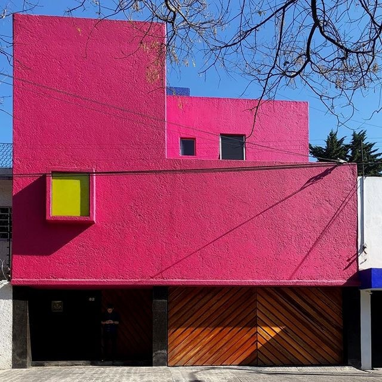
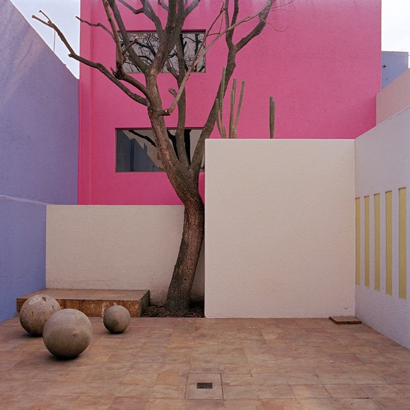
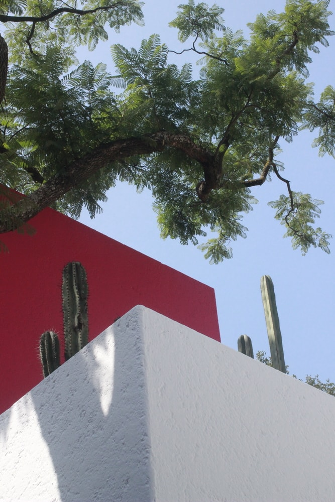
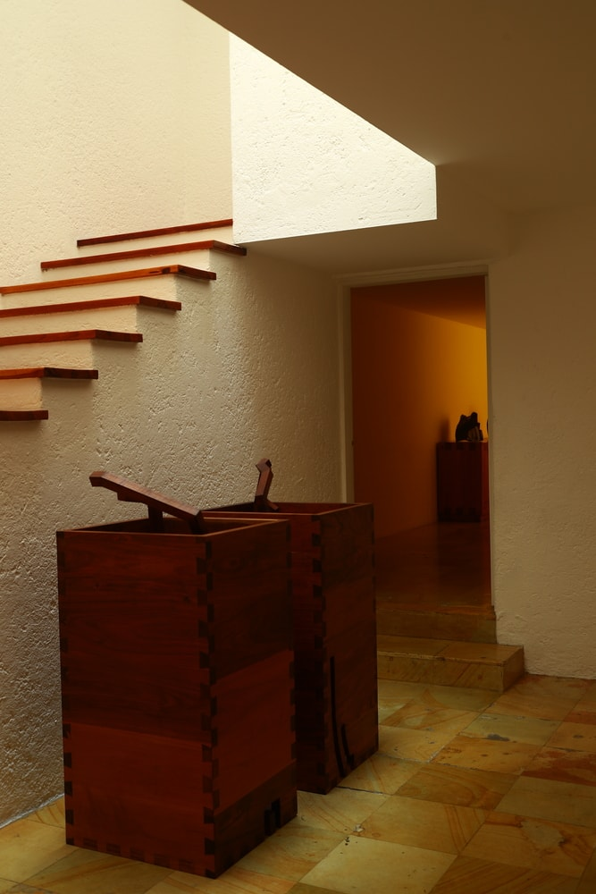
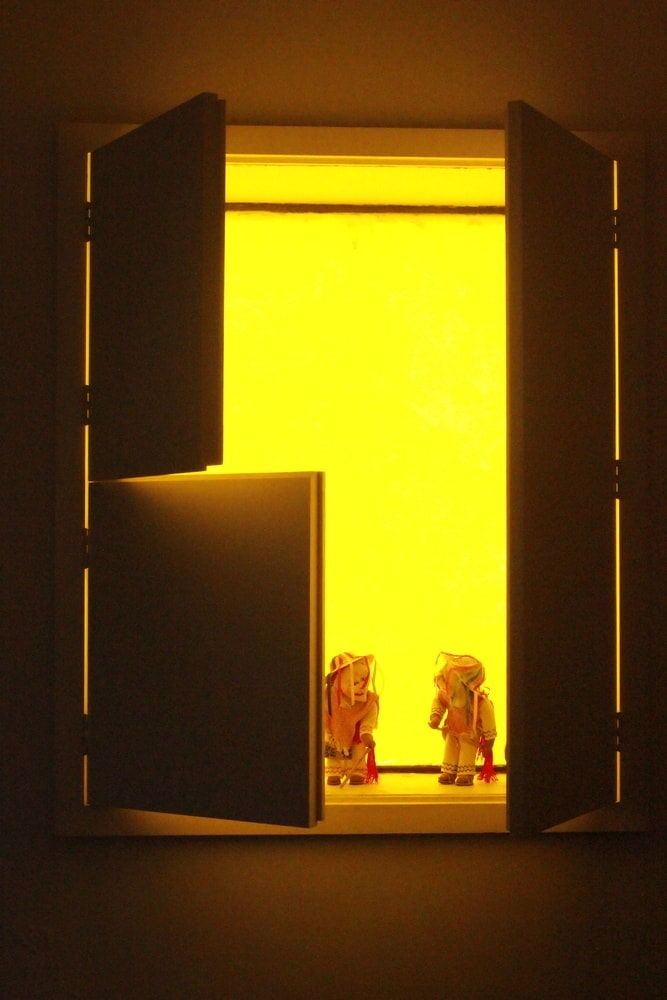
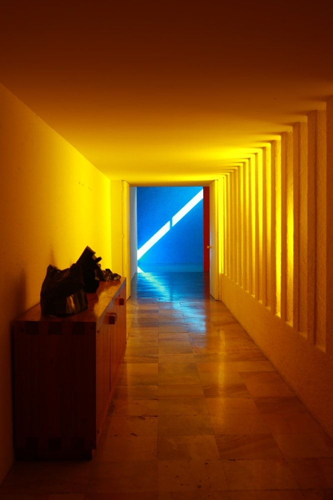
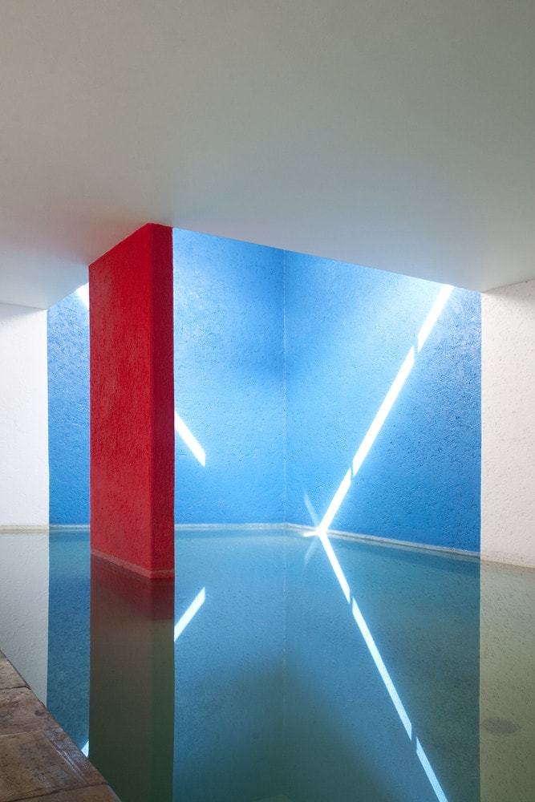

# Casa Gilardi

:::note info
💡 El edificio se asienta sobre un terreno alargado de 10 metros de ancho por 36 metros de largo. Durante la época de inicio del encargo, el arquitecto visualizó el terreno y señaló el árbol de jacaranda que se posa en las inmediaciones del lugar, objeto del cual Barragán toma la disposición de aceptar el encargo y desarrollar el proyecto alrededor de la especie natural.
:::

<!--  -->

> **Figura 37:**
> Fachada principal de la vivienda.
>
> *Casa Gilardi*,
> Ciudad de México - México,
> (1975-1978).
> Luis Barragán.

La casa Gilardi de Barragán se realizó entre los años 1975 a 1978 por encargo de dos jóvenes publicistas: Francisco *Pancho* Gilardi y Martín Luque, para la construcción de una vivienda destinada a contener un pequeño despacho de atención a sus clientes y contar con las áreas recreacionales necesarias, luego de una larga jornada de trabajo. Consiste en la última obra desarrollada en su totalidad por el arquitecto y una pieza de particular interés para la presente investigación.

El exterior de la vivienda consiste en un área de acceso peatonal y garaje, que dan inicio al desarrollo de la obra, ocultando de la vista del transeúnte el patio privado que contiene las habitaciones del primer nivel, esto con la finalidad doble de generar un espacio íntimo para el usuario y adaptar un confort acústico en el interior de la vivienda. Los elementos en fachada se identifican con un marcado color rosa empleado por Barragán, contrastado con la ventana de vidrio tintado cuya totalidad resulta en una composición de arquitectura moderna.

<!-- PorHacer: Colocar un plano de planta donde se muestre la descripción, figura y fuente.-->

El edificio se desarrolla principalmente con la agrupación de funciones esenciales para la vida en el frente del terreno adosadas al acceso principal, por lo que gran parte del lote se aprovecha para desarrollar las áreas sociales y de esparcimiento, en conjunto con el gran patio que ocupa el centro de la composición y dota de tonalidades verdes a la atmósfera arquitectónica con el pequeño jardín de cactus y el gran árbol de jacaranda.

<!--  -->

> **Figura 38:**
> Patio central de la vivienda.
>
> *Casa Gilardi*,
> Ciudad de México - México,
> (1975-1978).
> Luis Barragán.

La vivienda se puede interpretar con mayor claridad a través de tres aspectos fundamentales que la componen:

* La creación de ambientes aislados visual y acústicamente del espacio público, que generan su propia atmósfera brindando privacidad al habitante de la vivienda mientras que disfruta de momentos sociales.

<!--  -->

> **Figura 39:**
> Vista desde el interior del patio central.
>
> *Casa Gilardi*,
> Ciudad de México - México,
> (1975-1978).
> Luis Barragán.

* El desarrollo del recorrido genera un conjunto de espacialidades al tránsito del ocupante, cuya narrativa espacial y lumínica dota de sentido a cada uno de los elementos de transición en la obra.

<!--  -->

> **Figura 40:**
> Manipulación de las características de la luz como elemento integral del recorrido.
>
> *Casa Gilardi*,
> Ciudad de México - México,
> (1975-1978).
> Luis Barragán.

* La aplicación del color sobre las superficies generando tensión visual y complementando la composición arquitectónica a través de la luz reflejada y proyectada en los elementos establecidos dentro de la edificación.

<!--  -->

> **Figura 41:**
> Manipulación de tonalidad de la luz natural a través de elementos aruitectónicos.
>
> *Casa Gilardi*,
> Ciudad de México - México,
> (1975-1978).
> Luis Barragán.

De esta forma, el recorrido de la vivienda nos invita a desarrollar una procesión, al atravesar el corredor principal, adyacente al patio, que aprovecha la luz natural del mismo para teñirlo de amarillo y transportar al espectador a la percepción de nuevas espacialidades establecidas por la manipulación de las características de la luz.

<!--  -->

> **Figura 42:**
> Corredor principal de la vivienda.
>
> *Casa Gilardi*,
> Ciudad de México - México,
> (1975-1978).
> Luis Barragán.

Finalmente, en el área destinada al comedor y la alberca, ocurre el punto de inflexión que nos revela una apreciación de mayor complejidad para la experiencia del usuario; se nos revela el dinamismo de la luz y el paso del tiempo en un recinto de formas y colores que nos sugiere la experimentación de lo sagrado en lo cotidiano. La composición espacial y el uso de diferentes recursos materiales e inmateriales (el tiempo), nos proporcionan un elemento arquitectónico de características memorables. De aquí la introspección y el misterio en la arquitectura de Barragán.

<!--  -->

<!-- PorHacer: colocar la nota de la imagen a pié de página -->

> **Figura 43:**
> La manipulación de los elementos arquitectónicos para aprovechar la incidencia de la luz en el área de la alberca, podría considerarse análogo al funcionamiento de un reloj solar.
> 
> *Casa Gilardi*,
> Ciudad de México - México,
> (1975-1978).
> Luis Barragán.

:::info aspectos destacados
Destaca de la presente obra, el desarrollo arquitectónico de la pieza, tomando en cuenta el recorrido como el elemento principal que le da sentido a la arquitectura, otorgándole dinamismo espacial y lumínico a cada una de las áreas.
:::