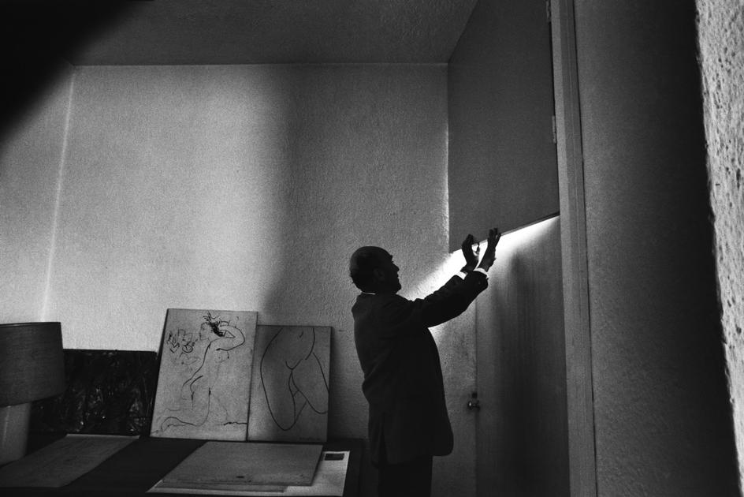

# Recopilación del pensamiento y criterios en las obras de Luis Barragán

<!-- # Síntesis de obra y pensamiento de Luis Barragán -->

:::note info
El discurso que expresa durante la ceremonia en la que se le otorga el premio Pritzker a Luis Barragán, evidencia los principios que rigen su proceso de creación arquitectónica, de esta manera, podemos identificar los elementos clave que en adelante se conocen como los principios de su *arquitectura emocional*, con el objetivo de humanizar la creación arquitectónica y dignificar la vida de quien la habita. A continuación, se adjuntan las palabras de Barragán.
:::

<!-- PorHacer: Fuente, Año y figura -->

<!--  -->

> *Luis Ramiro Barragán Morfín*.
>
> Guadalajara, 9 de marzo de 1902 – Ciudad de México, 22 de noviembre de 1988.

## Ceremonia de Premiación del Premio Pritzker

**Martes, 3 de junio de 1980.**

**Dumbarton Oaks, Estados Unidos.**

Deseo dejar constancia, además, de mi respeto y admiración por el pueblo norteamericano, gran mecenas de las ciencias y de las artes, y que sin encerrarse dentro de los límites de sus fronteras las trascendió para distinguir de manera tan honrosa y generosa, en este caso, a un hijo de México. Tengo plena conciencia, por tanto, que el premio que se me otorga es un acto de reconocimiento de la universalidad de la cultura y en particular de la cultura de mi patria. Pero como nunca nadie se debe todo a sí mismo, sería mezquino no recordar en este momento la colaboración, la ayuda y el estímulo que he recibido a lo largo de mi vida por parte de colegas, dibujantes, fotógrafos, escritores, periodistas y personales amigos que han tenido la bondad de interesarse en mis trabajos.

Quisiera valerme de esta ocasión para presentar ante ustedes algunos pensamientos, algunos recuerdos e impresiones que, en su conjunto, expresen la ideología que sustenta mi trabajo. Y a este respecto ya se anticipó –aunque con excesiva generosidad– el señor Jay A. Pritzker cuando explicó a la prensa que se me había concedido el Premio por considerar que me he dedicado a la arquitectura “como un acto sublime de la imaginación poética”. En mí se premia entonces, a todo aquél que ha sido tocado por la belleza. En proporción alarmante han desaparecido en las publicaciones dedicadas a la arquitectura las palabras belleza, inspiración, embrujo, magia, sortilegio, encantamiento y también las de serenidad, silencio, intimidad y asombro. Todas ellas han encontrado amorosa acogida en mi alma, y si estoy lejos de pretender haberles hecho plena justicia en mi obra, no por eso han dejado de ser mi faro.

### *Religión y Mito*

 ¿Cómo comprender el arte y la gloria de su historia sin la espiritualidad religiosa y sin el trasfondo mítico que nos lleva hasta las raíces mismas del fenómeno artístico? Sin lo uno y lo otro no habría pirámides de Egipto y las nuestras mexicanas; no habría templos griegos ni catedrales góticas ni los asombros que nos dejó el renacimiento y la edad barroca; no las danzas rituales de los mal llamados pueblos primitivos ni el inagotable tesoro artístico de la sensibilidad popular de todas las naciones de la Tierra. Sin el afán de Dios nuestro planeta sería un yermo de fealdad. “En el arte de todos los tiempos y de todos los pueblos impera la lógica irracional del mito”, me dijo un día mi amigo Edmundo O’Gorman, y con o sin su permiso me he apropiado sus palabras.

### *Belleza*

 La invencible dificultad que siempre han tenido los filósofos en definir la belleza es muestra inequívoca de su inefable misterio. La belleza habla como un oráculo, y el hombre, desde siempre, le ha rendido culto, ya en el tatuaje, ya en la humilde herramienta, ya en los egregios templos y palacios, ya, en fin, hasta en los productos industriales de la más alta tecnología contemporánea. La vida privada de belleza no merece llamarse humana.

### *Silencio*

 En mis jardines, en mis casas, siempre he procurado que prive el plácido murmullo del silencio, y en mis fuentes canta el silencio.

### *Soledad*

 Sólo en íntima comunión con la soledad puede el hombre hallarse a sí mismo. Es buena compañera, y mi arquitectura no es para quien la tema y la rehuya.

### *Serenidad*

 Es el gran y verdadero antídoto contra la angustia y el temor, y hoy, la habitación del hombre debe propiciarla. En mis proyectos y en mis obras no ha sido otro mi constante afán, pero hay que cuidar que no la ahuyente una indiscriminada paleta de colores. Al arquitecto le toca anunciar en su obra el evangelio de la serenidad.

### *Alegría*

 ¡Cómo olvidarla! Pienso que una obra alcanza la perfección cuando no excluye la emoción de la alegría, alegría silenciosa y serena disfrutada en soledad.

### *La muerte*

 La certeza de nuestra muerte es fuente de vida, y en religiosidad implícita en la obra de arte triunfa la vida sobre la muerte.

### *Jardines*

 En el jardín el arquitecto invita a colaborar con el reino vegetal. Un jardín bello es presencia permanente de la naturaleza, pero la naturaleza reducida a proporción humana y puesta al servicio del hombre, y es el más eficaz refugio contra la agresividad del mundo contemporáneo.

“El alma de los jardines”, decía Ferdinand Bac, “alberga la mayor suma de serenidad de que puede disponer el hombre”. Y fue Bac quien despertó en mí el anhelo de la arquitectura de jardín. El decía: “En este pequeño dominio (sus jardines de Les Colombiers) no he hecho otra cosa que unirme a la solidaridad milenaria que la que todos estamos sujetos, que no es sino la ambición de expresar con la materia un sentimiento común a muchos hombres en búsqueda de un vínculo con la naturaleza al crear un lugar de reposo, de placer apacible”. Ya se ve que es condición de un jardín aunar lo poético y lo misterioso con la serenidad de la alegría. No hay mejor expresión de la vulgaridad que un jardín vulgar.

En una vasta extensión de lava al sur de la ciudad de México me propuse, arrobado por la belleza de ese antiguo paisaje volcánico, realizar algunos jardines que humanizaran, sin destruir tan maravilloso espectáculo. Paseando entre las grietas de lava protegido por la sombra de imponentes murallas de roca viva, repentinamente descubrí. ¡Oh sorpresa encantadora!, pequeños secretos valles verdes rodeados y limitados por las más caprichosas, hermosas y fantásticas formaciones de piedra que había esculpido en la roca derretida el soplo de vendavales prehistóricos.

Tan inesperado hallazgo de esos valles me produjo una sensación no desemejante a la que tuve cuando, caminando por un estrecho y oscuro túnel de la Alhambra, se me entregó, sereno, callado y solitario, el hermoso patio de los mirtos de ese antiguo palacio. Contenía lo que debe contener un jardín bien logrado: nada menos que el universo entero. Jamás me ha abandonado tan memorable epifanía y no es casual que desde el primer jardín que realicé en 1941, todos los que le han seguido pretenden con humildad recoger el eco de la inmensa lección de la sabiduría plástica de los moros de España.

### *Fuentes*

Una fuente nos trae paz, alegría y apacible sensualidad alcanza la perfección de su razón de ser cuando por el hechizo de su embrujo, nos transporta, por decirlo así, fuera de este mundo. En la vigilia y en el sueño me ha acompañado a lo largo de mi vida el dulce recuerdo de fuentes maravillosas; las que marcaron para siempre mi niñez: los derramaderos de aguas sobrantes de las presas; los aljibes de las haciendas; los brocales de los pozos en los patios conventuales; las acequias por donde corre largamente el agua; los pequeños manantiales que reflejan las copas de los árboles milenarios; y los viejos acueductos que desde lejanos horizontes traen presurosos el agua a las haciendas con el estruendo de una catarata.

### *Arquitectura*

Mi obra es autobiográfica, como tan certeramente lo señaló Emilio Ambas en el texto del libro que publicó sobre mi arquitectura el Museo de Arte Moderno de Nueva York. En mi trabajo subyacen los recuerdos del rancho de mi padre donde pasé años de niñez y adolescencia, y en mi obra siempre alienta intento de transponer al mundo contemporáneo la magia de esas lejanas añoranzas tan colmadas de nostalgia. Han sido para mí motivo de permanente inspiración las lecciones que encierra la arquitectura popular de la provincia mexicana: sus paredes blanqueadas con cal; la tranquilidad de sus patios y huertas; el colorido de sus calles y el humilde señorío de sus plazas rodeadas de sombreados portales. Y como existe un profundo vínculo entre esas enseñanzas y las de los pueblos del norte de África y de Marruecos, también éstos han marcado con su sello mis trabajos.

Católico que soy, he visitado con reverencia y con frecuencia los monumentales conventos que heredamos de la cultura y religiosidad de nuestros abuelos, los hombres de la colonia, y nunca ha dejado de conmoverme el sentimiento de bienestar y paz que se apodera de mi espíritu al recorrer aquellos hoy deshabitados claustros, celdas y solitarios patios. Cómo quisiera que se reconociera en algunas de mis obras la huella de esas experiencias, como traté de hacerlo en la capilla de las monjas capuchinas sacramentarias en Tlalpan, ciudad de México.

### *El arte de ver*

Es esencial al arquitecto saber ver; quiero decir ver de manera que o se sobreponga el análisis puramente racional. Y con este motivo rindo aquí un homenaje a un gran amigo que con su infalible buen gusto estético fue maestro en ese difícil arte de ver con inocencia. Aludo al pintor Jesús (Chucho) Reyes Ferreira a quien tanto me complace traer ahora la oportunidad de reconocerle públicamente la deuda que contraje con él por sus sabias enseñanzas. Y a este propósito no está fuera de lugar traer a la memoria unos versos de otro gran y querido amigo, el poeta mexicano Carlos Pellicer: por la vista el bien y el mal nos llegan. Ojos que nada ven, almas que nada esperan.

### *La nostalgia*

Es conciencia del pasado, pero elevada a potencia poética, y como para el artista su personal pasado es la fuente de donde emanan sus posibilidades creadoras, la nostalgia es el camino para que ese pasado rinda los frutos de que está preñado. El arquitecto no debe, pues, desoír el mandato de las revelaciones nostálgicas, porque solo con ellas es verdaderamente capaz de llenar con belleza el vacío que le queda a toda obra arquitectónica una vez que ha atendido las exigencias utilitarias del programa. De lo contrario la arquitectura no puede aspirar a seguir contando entre las bellas artes.

Mi socio y amigo el joven arquitecto Raúl Ferrera y el pequeño equipo de nuestro taller comparten conmigo los conceptos que tan rudimentaria e insuficientemente he intentado presentar ante ustedes. Hemos trabajado y seguiremos trabajando animados por la fe en la verdadera estética de esa ideología y con la esperanza de que nuestra labor, dentro de sus muy modestos límites, coopere en la gran tarea de dignificar la vida humana por los senderos de la belleza y contribuya a levantar un dique contra el oleaje de deshumanización y vulgaridad.

> *Discurso de Luis Barragán con motivo de recibimiento del premio Pritzker de arquitectura*
>
> Tomado de [Revista Arquine](https://www.arquine.com/el-discurso-de-luis-barragan/)

<!-- PorHacer: colocar el enlace abajo -->