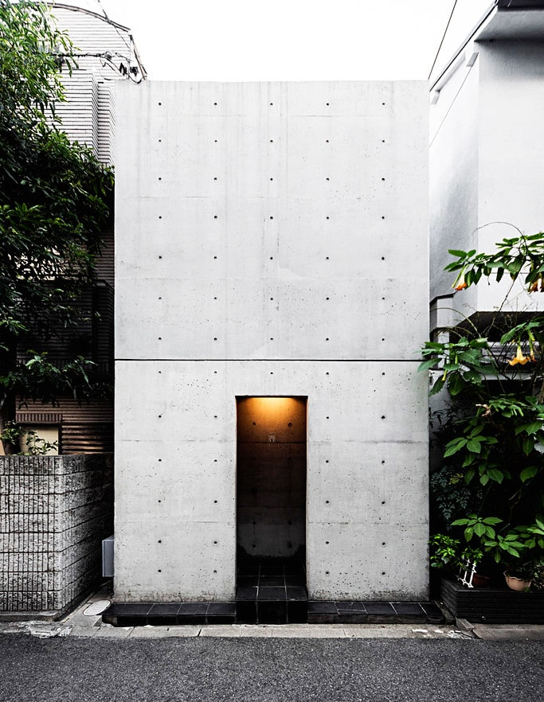
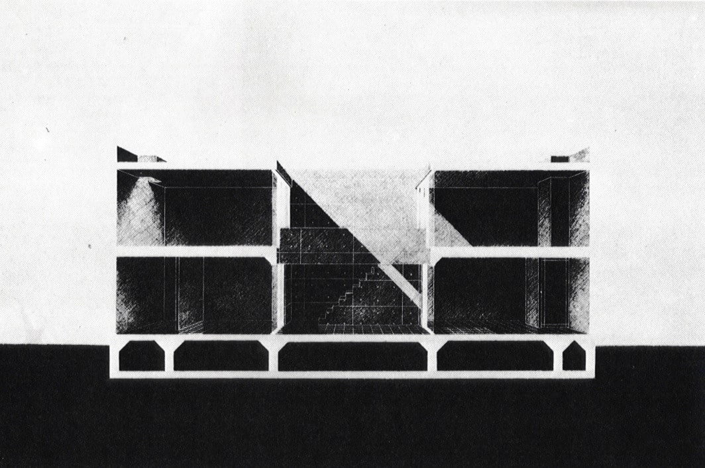
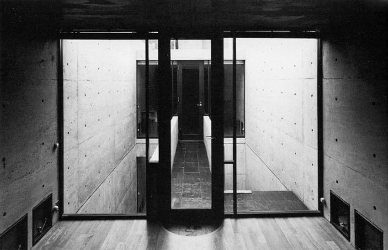

# Tadao Ando: Casa Azuma

<!--  -->

> **Figura 45:**
> Fachada principal de la vivienda.
>
> *Casa Azuma*,
> Osaka - Japón,
> (1975 - 1976).
> Tadao Ando.[^1]

En el centro de Osaka, todavía se pueden ver las hileras de casas de madera que sobrevivieron a la guerra; esta casa adosada en el distrito de *Sumiyoshi* reemplaza la porción central de tres de dichas casas. La intención, fue la de insertar una caja de concreto y crear un microcosmo con ella; una composición simple y cerrada aunque dramatizada por la luz.[^2]

El edificio presenta una fachada ciega a la calle. Solo la cavidad que constituye la entrada, nos aporta algún indicio de la vida que se desarrolla en su interior; el pórtico de acceso se ilumina con la luz natural y baña con un efecto de difusión lumínica el espacio de acceso.

<!--  -->

> **Figura 46:**
> Patio central de la vivienda.
>
> *Casa Azuma*,
> Osaka - Japón,
> (1975 - 1976).
> Tadao Ando.[^3]

Se trata de una caja de hormigón que ocupa todo el solar. La organización espacial es centrípeta en cuanto a su organización del espacio, tiene una planta tripartita centrada en un patio descubierto. El patio, que actúa como el eje de la vida cotidiana; separa la sala de estar, situada en un extremo de la planta baja de la cocina-comedor y el baño, situados en el otro. En la planta superior, la habitación secundaria se encara con el dormitorio principal situado al otro lado del patio central. Por medio de esta composición, el patio garantiza la privacidad para todas las habitaciones.

<!--  -->

> **Figura 47:**
> Sección longitudinal.
>
> *Casa Azuma*,
> Osaka - Japón,
> (1975 - 1976).
> Tadao Ando.[^4]

<!--  -->

> **Figura 48:**
> Habitación interior en relación directa con el patio central.
>
> *Casa Azuma*,
> Osaka - Japón,
> (1975 - 1976).
> Tadao Ando.[^5]

:::info aspectos destacados
Resulta de particular interés, el esquema compositivo en el que la obra se desarrolla a partir de un elemento central de la composición, contando con una función múltiple: En primera instancia, ilumina la zona habitable de la edificación manteniéndola en condiciones favorables de confort lumínico y a su vez, dota al edificio de un sistema de ventilación natural generado gracias a la influencia del patio. Espacialmente, unifica la edificación al relacionarla de manera directa con el cielo y las condiciones atmosféricas del lugar de emplazamiento.
:::

[^1]: **Perego, S. (2016, octubre 10).** Row House—Azuma House. Flickr. *Enlace:* https://www.flickr.com/photos/ste_peg/33037526535/

[^2]: **Dal Co, F., & Andō, T. (1995).** Tadao Ando: Complete works. Phaidon Press.

[^3]: **ArchiTravel. (2019, julio 24).** Row House (Azuma House) | ArchiTravel. *Enlace:* https://www.architravel.com/project/row-house-azuma-house/

[^4]: **Leggsdiamond. (2013).** Tadao Ando, Azuma House. Tumblr. *Enlace:* https://leggsdiamond.tumblr.com/post/52401693751

[^5]: **Angieri, G. (2012).** Casa Azuma de Tadao Ando. Diseño y Arquitectura. *Enlace:* https://www.disenoyarquitectura.net/2012/11/casa-azuma-de-tadao-ando.html
