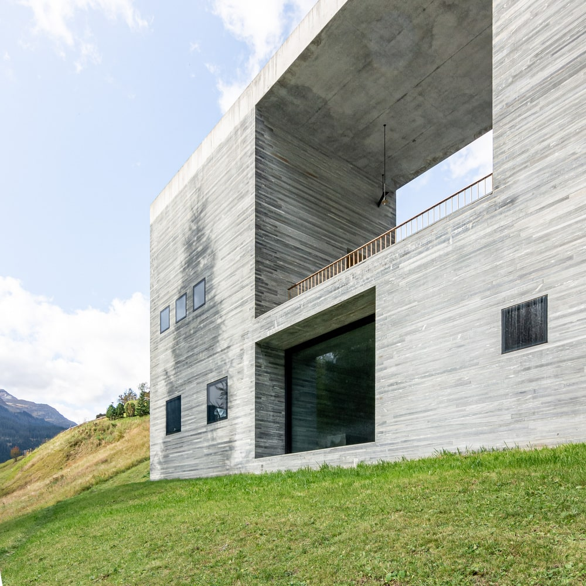
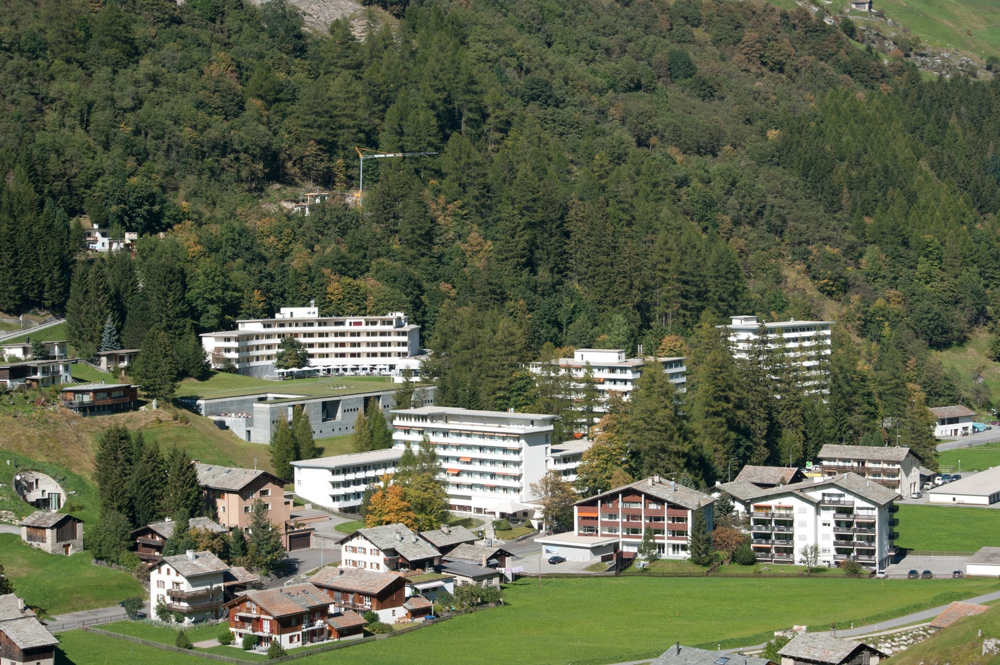
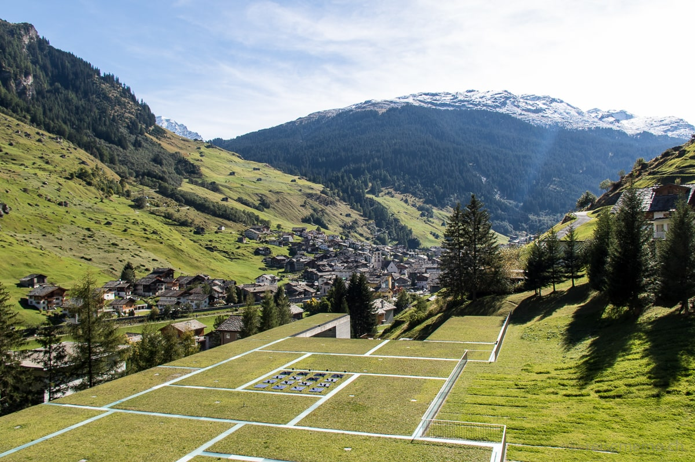
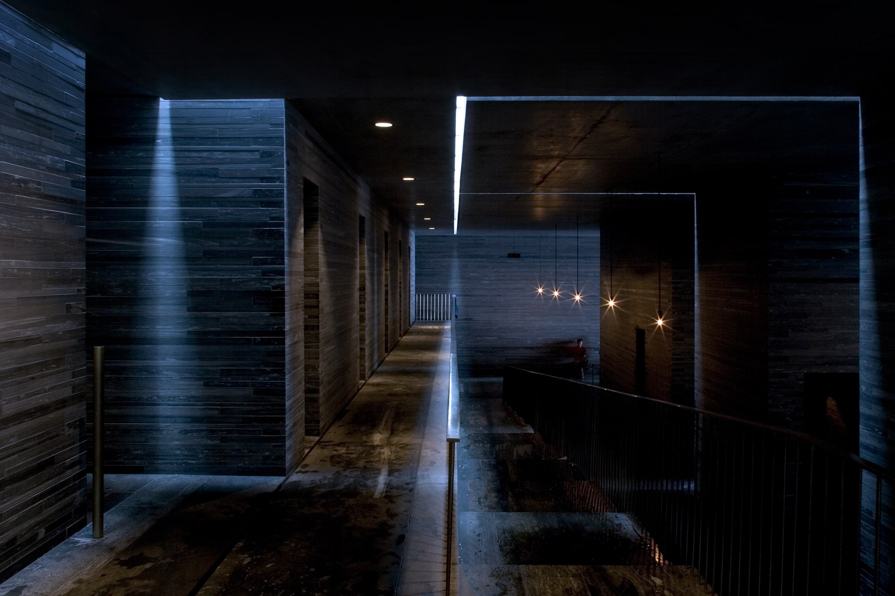
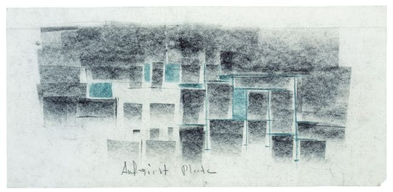
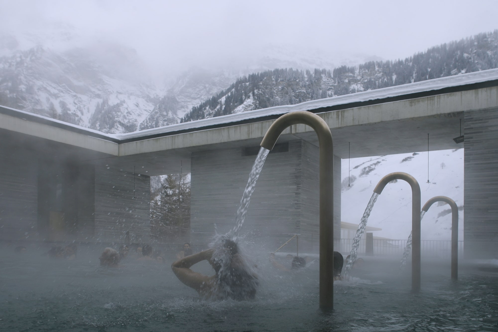
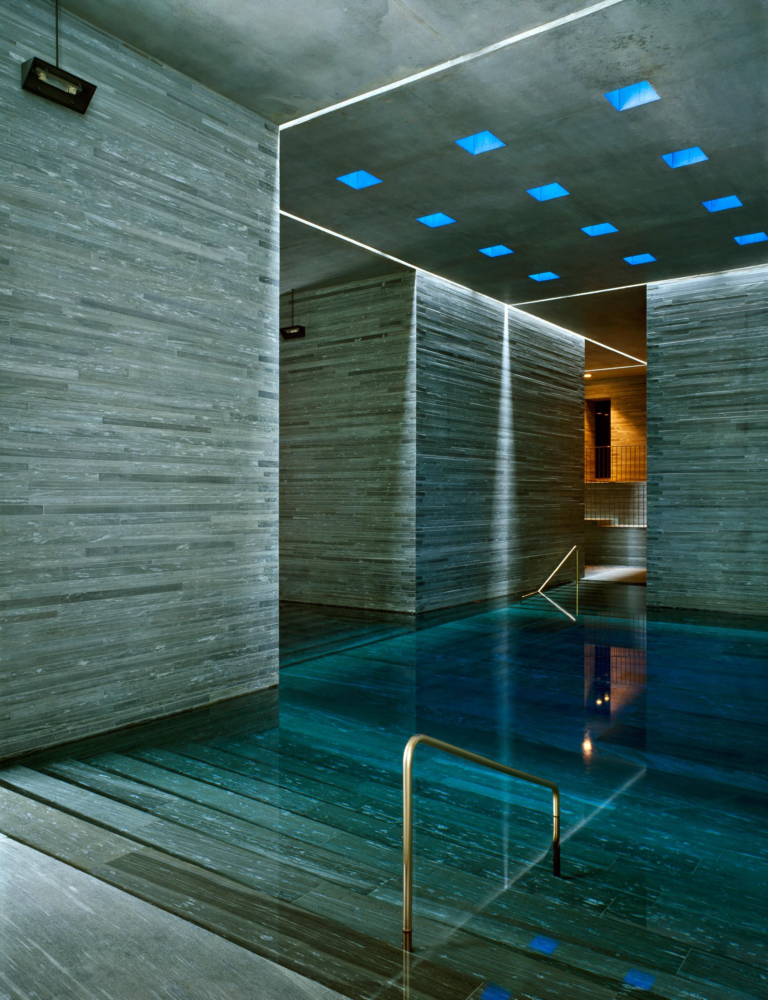

# Peter Zumthor: Termas de Vals
 
> Mi manera de inventar la arquitectura siempre empieza con una imagen clara, no solo con una idea; La idea, va siempre acompañada de una imagen clara, con la visualización de un acontecimiento corpóreo o físico. No es una idea abstracta. Estas primeras imágenes son ingenuas en un sentido casi infantil: me gustan mucho. Durante todo el proceso de desarrollo del edificio, procuro que esta imagen se convierta en arquitectura. Una arquitectura que exista por ella misma.
>
> **Peter Zumthor**[^1]

<!--  -->

> **Figura 49:**
> Fachada sureste de la edificación.
>
> *Termas de Vals*,
> Vals - Suiza,
> (1993 - 1996).
> Peter Zumthor.[^2]

El hotel se complementa con el actual complejo de baños termales, alrededor de 1960. El mismo cuenta con una presencia arquitectónica que refleja un destello de los estilos modernos de la década de los cincuenta. El segundo spa se volvió obsoleto a finales de 1996, siendo reemplazado por la implementación de las termas descritas a continuación.

Los nuevos baños termales, comprenden una estructura independiente sobre el inclinado rincón que abarca el área sur-este del hotel. El edificio toma la forma de un gran objeto de piedra cubierto de pasto, incrustado profundamente en la montaña y encajado en su costado.

<!--  -->

> **Figura 50:**
> Integración del edificio con su contexto inmediato.
>
> *Termas de Vals*,
> Vals - Suiza,
> (1993 - 1996).
> Peter Zumthor.[^3]

Se trata de un edificio solitario, que resiste la integración formal con la estructura existente, para evocar con claridad uno de sus motivos principales: el establecimiento de una relación espacial directa con el paisaje montañoso, su poder natural, su sustancia geológica y su característica topografía.

<!--  -->

> **Figura 51:**
> Implementación del edificio en la topografía.
>
> *Termas de Vals*,
> Vals - Suiza,
> (1993 - 1996).
> Peter Zumthor.[^4]

En paralelo, Zumthor tomó en consideración que el nuevo edificio debía transmitir la sensación de estar emplazado mucho antes que el edificio preexistente, es decir, de haber pertenecido siempre en el paisaje.

Montaña, piedra, agua, construcción con piedra, construcción en la montaña; constituyeron una cadena de palabras que se mantuvo constante a la hora de transformar la idea hacia la arquitectura.

Desde un principio, Zumthor experimenta un sentimiento por la naturaleza mística de un mundo de piedra dentro de la montaña, por la oscuridad y la luz, por el reflejo de la luz sobre el agua, por la difusión de la luz a través del aire lleno de vapor, por los diferentes sonidos que produce el agua en un entorno de piedra y girando en torno a la idea del ritual de bañarse.[^5]

<!--  -->

> **Figura 52:**
> Composición lumínica en espacios interiores.
>
> *Termas de Vals*,
> Vals - Suiza,
> (1993 - 1996).
> Peter Zumthor.[^6]

El uso consciente de estos elementos estuvo presente desde el principio del diseño, dando como resultado una arquitectura que sirve de espacio para las experiencias primarias y silenciosas de bañarse, limpiarse y relajarse en el agua regulada a diferentes temperaturas, en diferentes tipos de espacios para propiciar la conexión del usuario con su elemento introspectivo.

Un espacio continuo compuesto de un sistema de cuevas geométricas, se desarrolla en el interior de la estructura de las termas, aumentando sus dimensiones conforme se desarrolla la composición hacia la fachada sureste, bañada por la luz natural y enmarcada con las vistas frontales. Se consolida la relación entre el exterior y el interior del sistema de cuevas.

<!--  -->

> **Figura 53:**
> Conceptualización en planta del sistema de cuevas por Peter Zumthor.
>
> *Termas de Vals*,
> Vals - Suiza,
> (1993 - 1996).
> Peter Zumthor.[^7]

Los submódulos estructurales internos cubiertos por losas individuales, componen las termas en su conjunto. Estos no se terminan de tocar entre sí, conformando una red de fisuras que permiten el paso de la luz natural en el interior del edificio desde el plano superior, mediante la aplicación de unas juntas acristaladas translúcidas con 14 cm de separación entre sí. Visto desde arriba, la forma de organización de dichos submódulos, componen un patrón geométrico que ensamblan una composición rectangular.

<!--  -->

> **Figura 54:**
> Termas interiores.
>
> *Termas de Vals*,
> Vals - Suiza,
> (1993 - 1996).
> Peter Zumthor.[^8]

La perspectiva interna, generada por la composición de los elementos arquitectónicos se mantiene controlada asegurando o negando las visuales al usuario, de modo que las mismas y su percepción espacial, se regulan acorde a la función y significado dentro del conjunto.

<!--  -->

> **Figura 55:**
> Relación visual entre el edificio y el entorno natural.
>
> *Termas de Vals*,
> Vals - Suiza,
> (1993 - 1996).
> Peter Zumthor.[^9]

:::info aspectos destacados
Una de las premisas del proyecto de Zumthor, es la integración en el emplazamiento de la edificación y de cómo esta se relaciona directamente con su entorno. Al aprovechar el recurso del agua, topografía, materiales y las vistas que ofrece hacia el entorno. La suma de estas consideraciones individuales, traen como resultado un edificio en consonancia espacial y visual al lugar donde pertenece.
:::

[^1]: **Copans, R. (2000).** Les Thermes De Pierre.

[^2]: **Ceriani, A. (2009).** Gallery of The Therme Vals / Peter Zumthor. ArchDaily. *Enlace:* https://www.archdaily.com/13358/the-therme-vals/5fc1418963c017d62c00122a-the-therme-vals-photo

[^3]: **Camus, F. (2015).** Galería de Termas de Vals. ArchDaily México. *Enlace:* https://www.archdaily.mx/mx/765256/termas-de-vals-peter-zumthor/552b1470e58ecea1190004f2-fc_5-jpg

[^4]: **Montieth, B. (2015, octubre 29).** Say No to Style: Community Oriented Architecture. Angles. *Enlace:* https://carolinaangles.com/2015/10/29/say-no-to-style-community-oriented-architecture/

[^5]: **Zumthor, P., Binet, H., & Zumthor, P. (1999).** Peter Zumthor, works: Buildings and projects, 1979 - 1997. Birkhäuser.

[^6]: **Guerra, F. (2016).** Peter Zumthor’s Therme Vals. ArchDaily. *Enlace:* https://www.archdaily.com/798360/peter-zumthors-therme-vals-through-the-lens-of-fernando-guerra/580fb36ce58ecefd6700008e-peter-zumthors-therme-vals-through-the-lens-of-fernando-guerra-photo?next_project=no

[^7]: **Zumthor, P. (2021).** Termas de Vals. WikiArquitectura. *Enlace:* https://es.wikiarquitectura.com/edificio/termas-de-vals/

[^8]: **Guerra, F. (2016).** Peter Zumthor’s Therme Vals. ArchDaily. *Enlace:* https://www.archdaily.com/798360/peter-zumthors-therme-vals-through-the-lens-of-fernando-guerra/580faf4ce58ece64b8000032-peter-zumthors-therme-vals-through-the-lens-of-fernando-guerra-photo

[^9]: **Zumthor, P. (2021).** The Therme Vals. Modlar. *Enlace:* https://www.modlar.com/photos/2671/the-therme-vals-pool/
