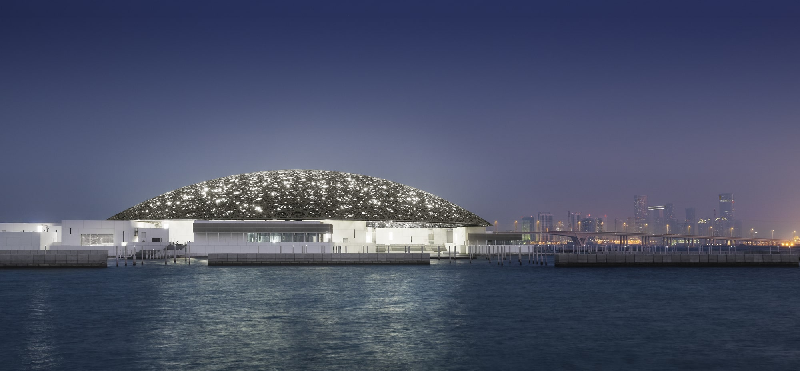
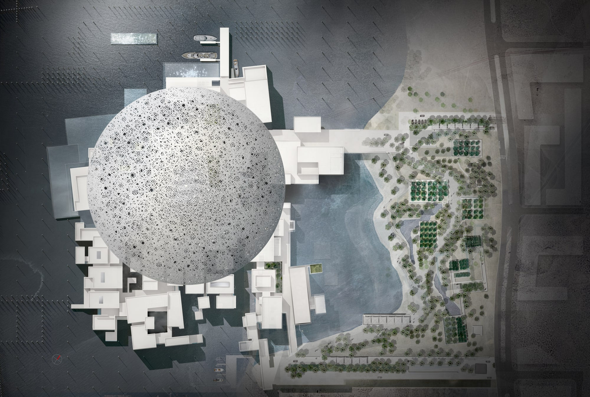
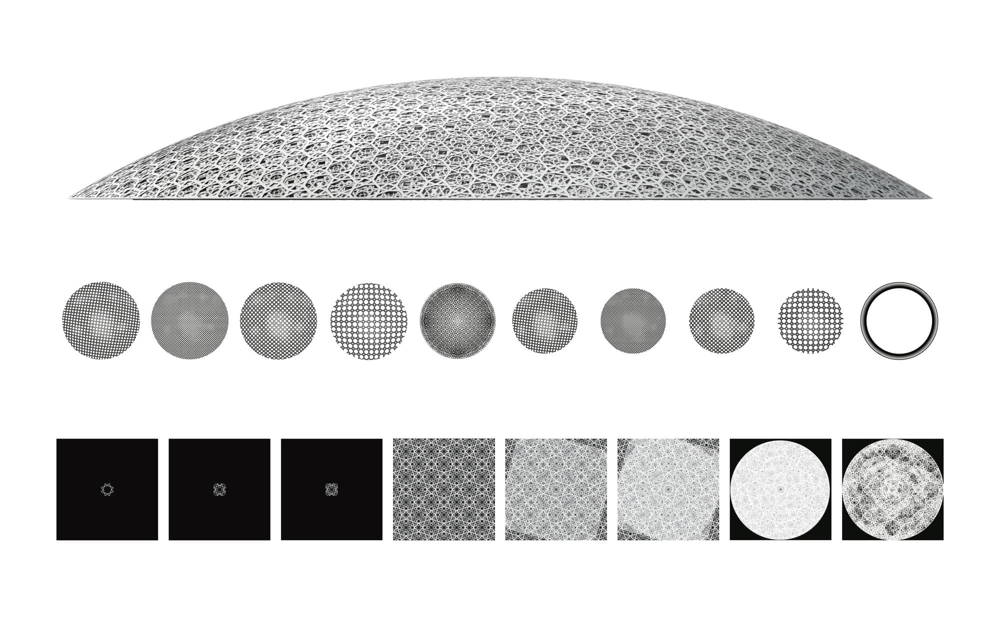
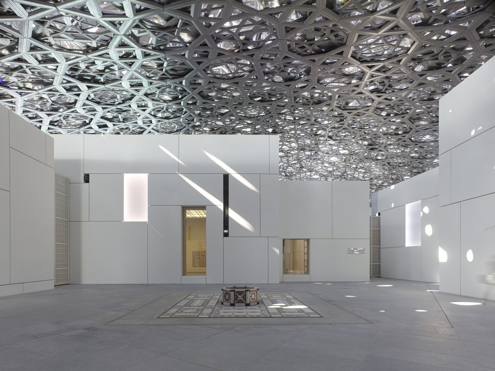
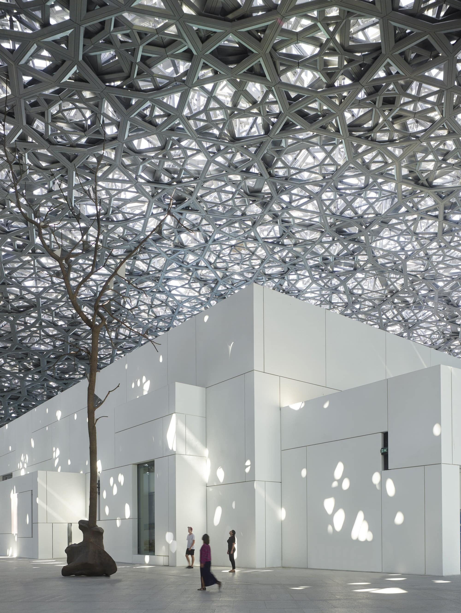
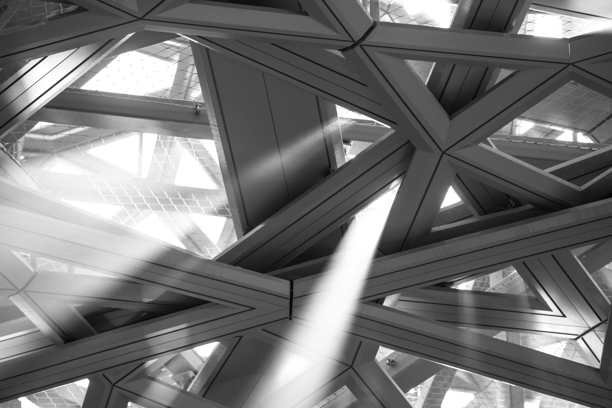

# Jean Nouvel: Museo Louvre de Abu Dhabi

<!--  -->

> **Figura 56:**
> Vista exterior del conjunto.
>
> *Museo Louvre*,
> Abu Dhabi - Emiratos Árabes,
> (2013 - 2017).
> Jean Nouvel.[^1]

## El museo y el mar

> En todos los climas, gustan las excepciones. Más cálido cuando está frío. Más fresco en los trópicos. A las personas no les agrada el choque térmico; tampoco a las obras de arte. Estas observaciones elementales han influenciado el Louvre de Abu Dhabi. Quiere crear un mundo acogedor combinando serenamente luz y sombra, reflexión y calma. Desea pertenecer a un país, a su historia, a su geografía sin convertirse en una traducción plana, el pleonasmo que resulta en convención y aburrimiento. También apunta a enfatizar la fascinación generada por encuentros raros.
> 
> Es bastante inusual encontrar un archipiélago construido en el mar. Es mucho más inusual ver que está protegido por un parasol que emana una lluvia de luz.
> 
> La posibilidad de acceder al museo en bote o encontrar un pontón para llegar caminando desde la orilla, es igualmente extraordinaria; antes de ser recibido, como un visitante muy esperado con la disposición de ver colecciones únicas, permanecer en tentadoras librerías o probar los tés, cafés y delicateses locales.
> 
> Es a su vez un lugar tranquilo y complejo, contrastando entre una serie de museos que cultivan sus diferencias y autenticidades.
> 
> Es un proyecto fundamentado en un símbolo mayor de la arquitectura Árabe: La Cúpula. Pero es aquí, donde se hace evidente el cambio de tradición, la cúpula constituye una propuesta moderna.
> 
> Una doble cúpula de 180 metros de diámetro, que ofrece una geometría horizontal perfectamente radiante, un material tejido y perforado aleatoriamente que proporciona la sombra salpicada por ráfagas solares. La cúpula brilla bajo el sol de Abu Dhabi. Por la noche, este paisaje protegido es un oasis de luz bajo una cúpula estrellada.
> 
> El Louvre de Abu Dhabi se convierte en el destino final de un paseo urbano, un jardín en la costa, un fresco refugio, un abrigo de luz durante el día y la noche, su estética consistente con su propósito como santuario para las obras de arte más preciadas.
> 
> **Jean Nouvel**[^2]

Jean Nouvel diseña el Louvre de Abu Dhabi inspirado en la cultura tradicional árabe. Tomando un acercamiento contextual al lugar de emplazamiento, Nouvel diseña el proyecto como una *ciudad museo* en el mar. Se compone de 55 edificios individuales que conforman la mencionada *ciudad museo*; contiene 23 galerías de exposición. Las fachadas de los edificios están construidas con 3900 paneles de fibra de concreto de ultra-alto rendimiento (UHPC).[^3]

<!--  -->

> **Figura 57:**
> Representación del proyeto en conjunto.
>
> *Museo Louvre*,
> Abu Dhabi - Emiratos Árabes,
> (2013 - 2017).
> Jean Nouvel.[^4]

Una gran cúpula de 180 metros de diámetro, visible desde el mar, los alrededores y la ciudad de Abu Dhabi, cubre la mayor parte de la *ciudad museo*. El domo fue construido por la empresa austríaca Waagner Biro, especializada en estructuras de acero. El domo consiste de ocho capas diferentes: Cuatro capas externas revestidas en acero inoxidable y cuatro capas internas revestidas de aluminio, separadas por un marco de madera de cinco metros de altura. El marco está constituido por 10.000 elementos estructurales preensamblados en 85 supermódulos, cada uno con una masa superior a las 50 toneladas.

<!--  -->

> **Figura 58:**
> Diseño iterativo por capas de la cúpula.
>
> *Museo Louvre*,
> Abu Dhabi - Emiratos Árabes,
> (2013 - 2017).
> Jean Nouvel.[^5]

El patrón complejo de la cúpula, resulta de una estudiada propuesta geométrica  en colaboración entre el equipo de diseño y los ingenieros estructurales; repitiéndose en varios tamaños y ángulos en las ocho capas superpuestas. Cada rayo de luz penetra las capas antes de aparecer y desaparecer sobre las superficies internas; como resultado, se aprecia un efecto cinemático conforme transcurre el recorrido solar. Durante la noche, son visibles 7.850 estrellas dentro y fuera del complejo. Estos fenómenos, los cataloga Nouvel bajo la definición de *lluvia de luz*, posibilitados gracias a la elaboración de diversos modelos durante las fases de diseño del proyecto, estableciendo las características distintivas del concepto del conjunto.

<!--  -->

> **Figura 59:**
> Efecto "lluvia de luz" en imágen conceptual.
>
> *Museo Louvre*,
> Abu Dhabi - Emiratos Árabes,
> (2013 - 2017).
> Jean Nouvel.[^6]

Sólo cuatro pilares soportan la cúpula, cada uno separado por una distancia de 110 metros. Su ubicación se mantiene oculta entre los edificios del museo, lo que favorece la impresión de que el domo flota entre los edificios. La altura interior de la cúpula es de 29 metros desde planta baja hasta sus recubrimientos inferiores. El punto más alto de la cúpula, se establece a unos 40 metros sobre el nivel del mar y 36 metros sobre la planta baja del edificio.

<!--  -->

> **Figura 60:**
> La monumentalidad de la cúpula, delimita el espacio y la percepción sensorial del usuario.
>
> *Museo Louvre*,
> Abu Dhabi - Emiratos Árabes,
> (2013 - 2017).
> Jean Nouvel.[^7]

El diseño del museo representa una síntesis entre el diseño tradicional y las técnicas de construcción modernas. El ambiente apacible del lugar, anima a los visitantes a disfrutar de la siempre cambiante relación entre el sol y la cúpula, el edificio y la tierra.

<!--  -->

> **Figura 61:**
> El efecto "lluvia de luz", es visible durante el día.
>
> *Museo Louvre*,
> Abu Dhabi - Emiratos Árabes,
> (2013 - 2017).
> Jean Nouvel.[^8]

:::info aspectos destacados
Resulta de particular interés para la investigación el mecanismo de la doble piel en la cubierta, actuando como filtro para el paso de la luz sobre el interior del edificio. Este *artilugio arquitectónico* permite evaluar con mayor visibilidad, las dinámicas de luz y sombra producidas entre la luz solar y la arquitectura.
:::

[^1]: **Ateliers Jean Nouvel. (2017, noviembre 8).** Louvre Abu Dhabi. ArchDaily. *Enlace:* https://www.archdaily.com/883157/louvre-abu-dhabi-atelier-jean-nouvel/5a01bfddb22e38b1dc0004e3-louvre-abu-dhabi-atelier-jean-nouvel-photo?next_project=no

[^2]: **Nouvel, J. (2017).** Louvre Abu Dhabi. Ateliers Jean Nouvel. *Enlace:* http://www.jeannouvel.com/en/projects/louvre-abou-dhabi-3/

[^3]: **Ateliers Jean Nouvel. (2017, noviembre 8).** Louvre Abu Dhabi. ArchDaily. *Enlace:* https://www.archdaily.com/883157/louvre-abu-dhabi-atelier-jean-nouvel

[^4]: **Ateliers Jean Nouvel. (2017, noviembre 8).** Louvre Abu Dhabi. ArchDaily. *Enlace:* https://www.archdaily.com/883157/louvre-abu-dhabi-atelier-jean-nouvel/5a01c0e3b22e38b1dc0004e8-louvre-abu-dhabi-atelier-jean-nouvel-c-ateliers-jean-nouvel-roof-plan?next_project=no

[^5]: **Ateliers Jean Nouvel. (2017, noviembre 8).** Louvre Abu Dhabi. ArchDaily. *Enlace:* https://www.archdaily.com/883157/louvre-abu-dhabi-atelier-jean-nouvel/5a01c741b22e38b1dc000512-louvre-abu-dhabi-atelier-jean-nouvel-c-ateliers-jean-nouvel-dome-pattern?next_project=no

[^6]: **Ateliers Jean Nouvel. (2017, noviembre 8).** Louvre Abu Dhabi. ArchDaily. *Enlace:* https://www.archdaily.com/883157/louvre-abu-dhabi-atelier-jean-nouvel/5a01bf97b22e3816ed000250-louvre-abu-dhabi-atelier-jean-nouvel-photo?next_project=no

[^7]: **Ateliers Jean Nouvel. (2017, noviembre 8).** Louvre Abu Dhabi. ArchDaily. *Enlace:* https://www.archdaily.com/883157/louvre-abu-dhabi-atelier-jean-nouvel/5a01bf6bb22e3816ed00024f-louvre-abu-dhabi-atelier-jean-nouvel-photo?next_project=no

[^8]: **Ateliers Jean Nouvel. (2017, noviembre 8).** Louvre Abu Dhabi. ArchDaily. *Enlace:* https://www.archdaily.com/883157/louvre-abu-dhabi-atelier-jean-nouvel/5a01c01fb22e38b1dc0004e4-louvre-abu-dhabi-atelier-jean-nouvel-photo?next_project=no
