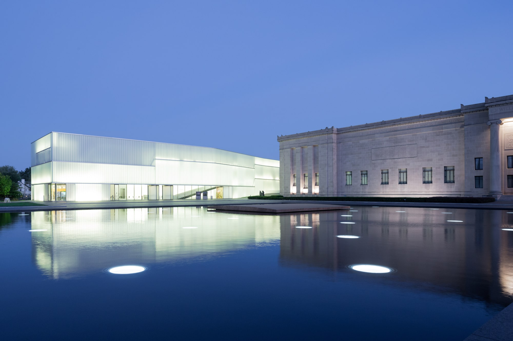
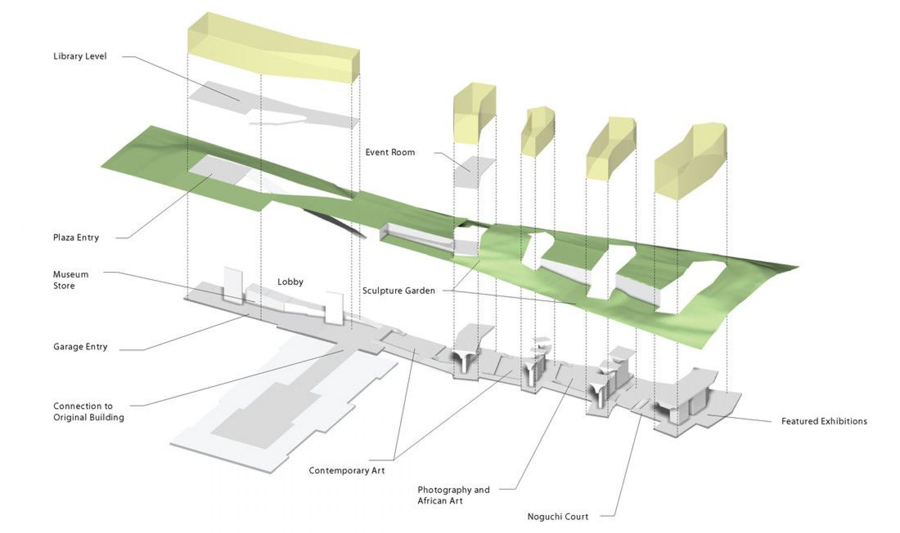
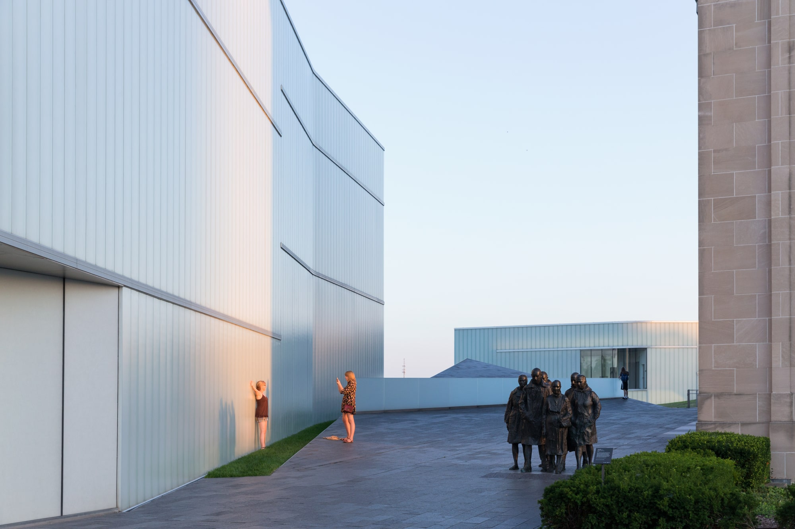
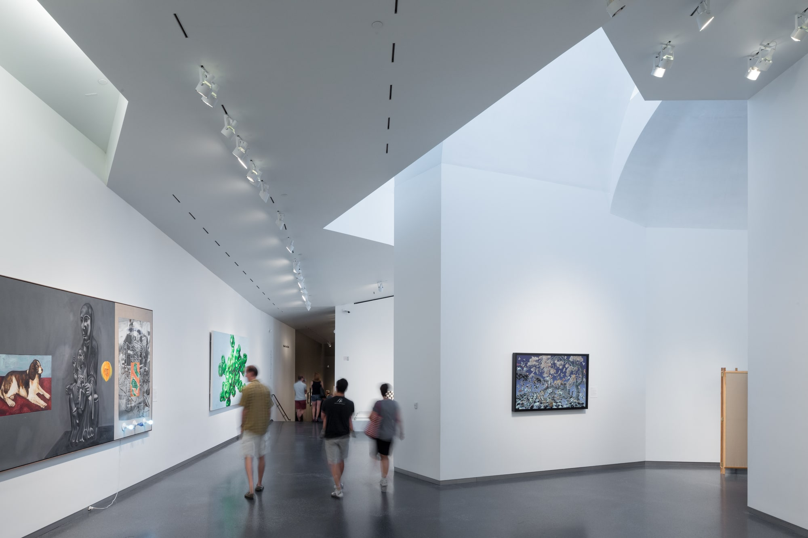
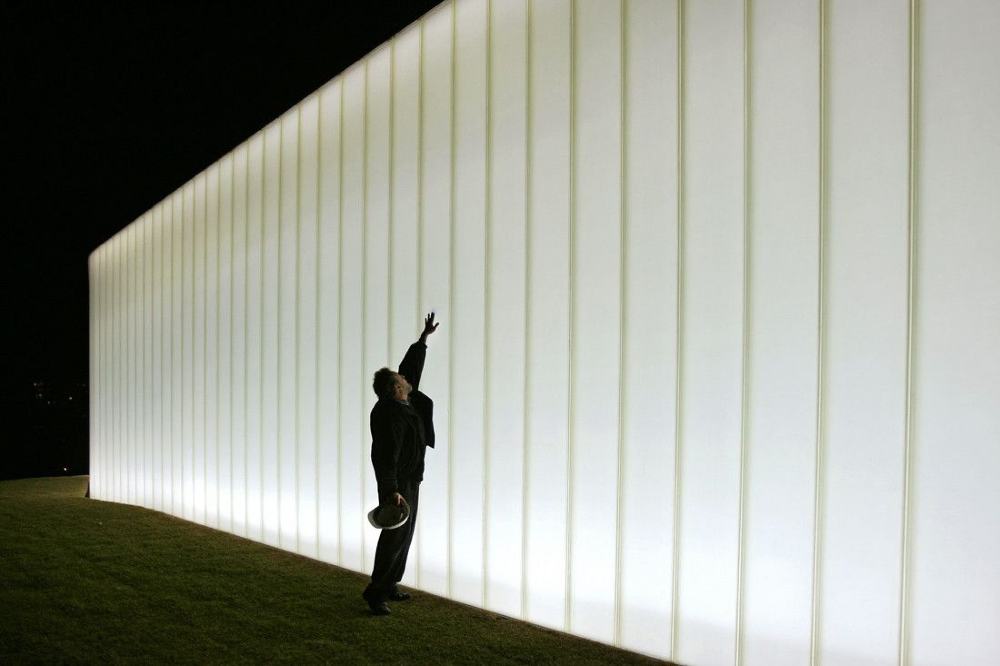
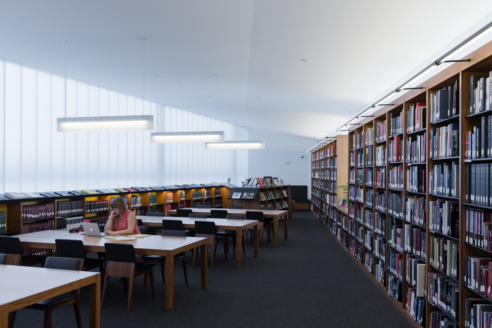
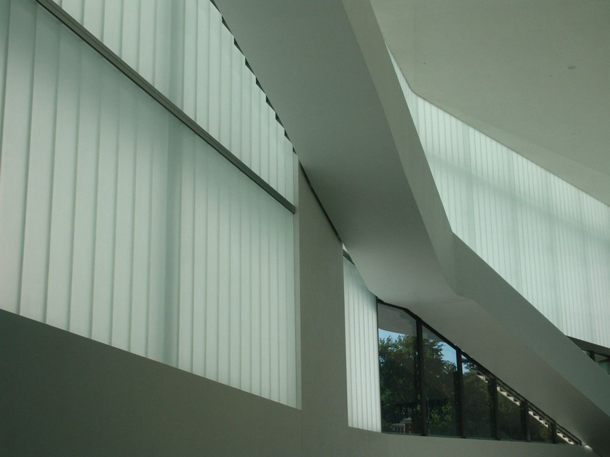
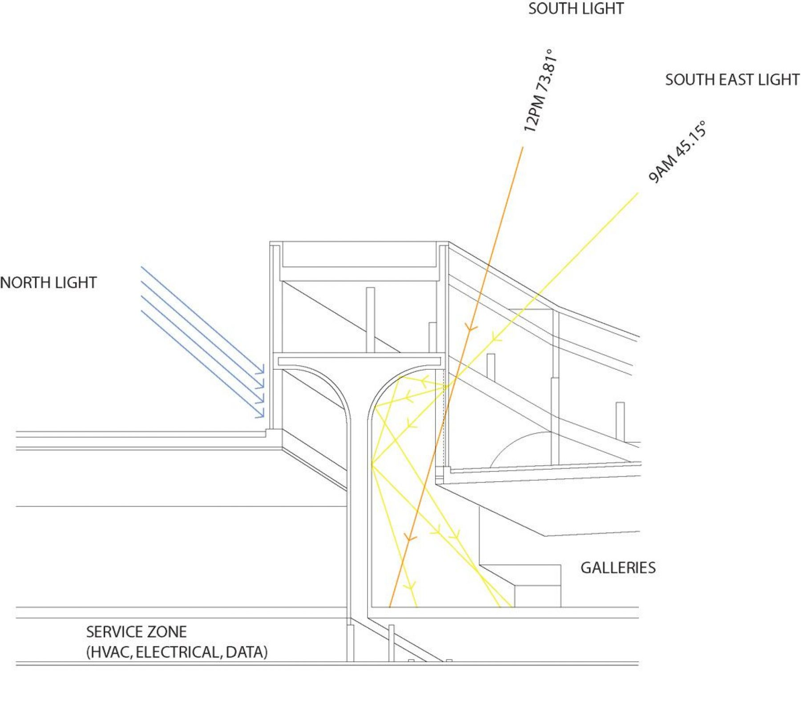
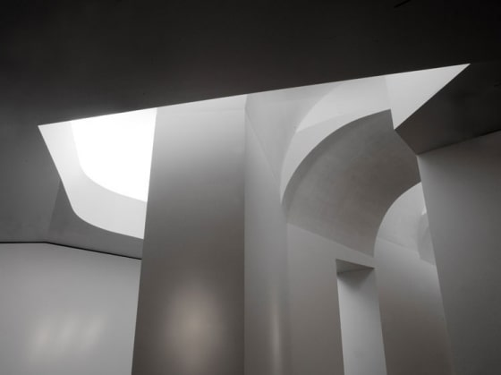

# Steven Holl: Ampliación del Museo de arte Nelson Atkins

> La ampliación del Museo de Arte Nelson Atkins, fusiona la arquitectura con su entorno para crear una arquitectura experiencial que se despliega para los visitantes tal como se percibe, con el movimiento de cada individuo a través del espacio y el tiempo.
> 
> **Steven Holl**, (2006).

<!--  -->

> **Figura 63:**
> Ampliación del Museo de Arte Nelson Atkins, *contraste complementario* entre edificaciones.
>
> *Museo de arte Nelson Atkins*,
> Kansas - Estados Unidos,
> (2007).
> Steven Holl.

La nueva ampliación llamada "The Bloch Building", se acopla con el jardín de esculturas existente, transformando el conjunto del museo en un recinto para la experiencia del visitante. La nueva adición se extiende a lo largo del *flanco este* del campus, y se distingue por cinco *linternas de vidrio*, que atraviesan el edificio existente a través del Parque de Esculturas, formando nuevos espacios y ángulos de visión. Conforme los visitantes desarrollan su recorrido, en el interior experimentan un flujo entre luz, arte, arquitectura y paisaje, con vistas desde un nivel hacia otro, desde adentro hacia afuera.

<!--  -->

> **Figura 64:**
> Configuración espacial y funcional del proyecto arqutiectónico.
>
> *Museo de arte Nelson Atkins*,
> Kansas - Estados Unidos,
> (2007).
> Steven Holl.

El movimiento entrelazado entre las *linternas captadoras de luz* de la nueva incorporación, tejen el nuevo edificio con el paisaje en un dinamismo fluido, basado en una relación sensible con su contexto. En lugar de incorporar un solo bloque, los cinco nuevos elementos existen en *contraste complementario* con el clásico "Templo del Arte", original de 1933.

<!--  -->

> **Figura 65:**
> Relación de los recorridos exteriores con las obras existentes.
>
> *Museo de arte Nelson Atkins*,
> Kansas - Estados Unidos,
> (2007).
> Steven Holl.

La primera de las cinco "linternas" conforma un lobby luminoso y transparente, con café, biblioteca de arte y librería; invitando al público dentro del Museo y favoreciendo el movimiento a través de rampas hacia las galerías, conforme se desarrolla el recorrido en descenso bajo el jardín. Además, desde el lobby, un nuevo eje transversal se conecta hacia los espacios del edificio original.

<!--  -->

> **Figura 66:**
> Recorrido subterráneo de las galerías.
>
> *Museo de arte Nelson Atkins*,
> Kansas - Estados Unidos,
> (2007).
> Steven Holl.

Durante la noche, el volumen del lobby se enciende con luz artificial e irradia sobre espacios interiores y exteriores. Las pantallas multicapa acristaladas que conforman los cerramientos, destacan al permitir recoger, difundir y refractar la luz. El aspecto de la luz a través de las pantallas materializa el medio refractivo, otorgándole la apariencia de bloques de hielo.

<!--  -->

> **Figura 67:**
> Iluminación artificial del edificio en contexto nocturno.
>
> *Museo de arte Nelson Atkins*,
> Kansas - Estados Unidos,
> (2007).
> Steven Holl.

Durante el día, las linternas inyectan las cualidades variables de la luz dentro de las galerías, mientras que durante la noche, el jardín de esculturas brilla con la luz interna refractada hacia el exterior.

<!--  -->

> **Figura 68:**
> La refracción de la luz natural durante el día, complementando los usos de la edificación.
>
> *Museo de arte Nelson Atkins*,
> Kansas - Estados Unidos,
> (2007).
> Steven Holl.

El *recorrido serpenteante* hilado entre las linternas en el Parque de esculturas, se complementa con el flujo abierto continuo del nivel inferior de galerías. Organizado en secuencia, el recorrido descendente permite la progresión de las colecciones, matizadas por las vistas del paisaje.

El diseño para la nueva adición, utiliza conceptos de edificaciones sostenibles. El jardín de esculturas continúa sobre las cubiertas de la galería, creando patios de esculturas entre las linternas, al mismo tiempo que emplean el uso de techos verdes para lograr un alto aislamiento térmico y proporcionar el aprovechamiento de las aguas pluviales.

<!--  -->

> **Figura 69:**
> Iluminación natural interior de la edificación.
>
> *Museo de arte Nelson Atkins*,
> Kansas - Estados Unidos,
> (2007).
> Steven Holl.

En el corazón de la propuesta arquitectónica, se destacan las unidades estructurales en forma de "T" llamadas "Breathing T's", que cumplen múltiple función: 

- Las de actuar como claraboyas que regulan el paso de la luz hacia las salas de la galería a través de su superficie curva.

- Servir como soporte estructural para los vidrios en suspensión.

- Proveer el espacio de instalación para los ductos de ventilación mecánica.

Las cavidades de doble vidrio de las claraboyas, recogen los vientos cálidos durante el invierno y los expulsa en verano; además, los niveles óptimos de iluminación, son regulados a través de pantallas controladas por ordenadores y por el material aislante translúcido empotrado en las cavidades del vidrio.

<!--  -->

> **Figura 70:**
> Sección de los elementos estructurales "Breathing T's".
>
> *Museo de arte Nelson Atkins*,
> Kansas - Estados Unidos,
> (2007).
> Steven Holl.

Una planta de servicio contínua en el sótano, bajo el nivel de las galerías, posibilita el recorrido de las obras de arte, almacenamiento y espacios de maniobra, así como el acceso a las "Breathing T's".

<!--  -->

> **Figura 71:**
> Efectos lumínicos a través de elementos estructurales.
>
> *Museo de arte Nelson Atkins*,
> Kansas - Estados Unidos,
> (2007).
> Steven Holl.

:::note info
💡 Para la presente investigación, se destaca el uso de distintas técnicas que permiten la regulación y el paso controlado de la luz natural y artificial dentro y fuera del edificio. Destacan los elementos estructurales escultóricos, que permiten la regulación de las condiciones lumínicas dentro de las salas de exposición. El recorrido y las obras de arte se convierten en una experiencia integral.
:::

<!-- ---

https://www.arch2o.com/nelson-atkins-museum-steven-holl/

https://www.stevenholl.com/projects/nelson-atkins-museum-of-art

https://www.archdaily.com/4369/the-nelson-atkins-museum-of-art-steven-holl-architects

https://www.architonic.com/es/project/steven-holl-the-nelson-atkins-museum-of-art/5100135

https://www.plataformaarquitectura.cl/cl/791485/iwan-baan-photographs-steven-holls-nelson-atkins-museum-for-its-ninth-birthday -->

