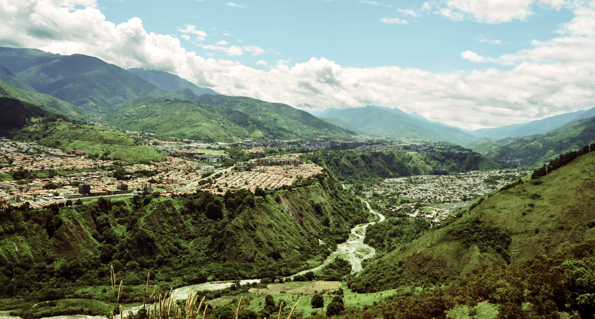

# El Lugar

<!--  -->

> *Vista aérea de la ciudad de Mérida*.

*Santiago de los Caballeros de Mérida* fue fundada el 9 de octubre de 1558, se ubica en la parte central de la cordillera andina venezolana, en una amplia terraza del valle medio del río Chama, entre la Sierra Nevada de Mérida por el sur-este y la Sierra La Culata por el norte-oeste. El casco histórico de la ciudad, donde se ubica el terreno destinado al proyecto de la presente investigación, se encuentra en la meseta de origen aluvial llamada Tatuy.

Históricamente, la ciudad mantuvo un crecimiento moderado hasta la aparición del boom petrolero nacional ocurrido durante el mandato del presidente Juan Vicente Gómez, en el cual su desarrollo ocurre de manera mas acelerada. Hasta la década de los sesenta, el crecimiento se ve estabilizado; siendo el Estado el principal promotor de viviendas y servicios a gran escala.

La historia de la ciudad está intrínsecamente ligada a la existencia de la Universidad de Los Andes, y el desarrollo de la misma ha generado impacto en la región a través de diferentes dinámicas tanto sociales como económicas. A tal punto ha estado relacionada la influencia de la Universidad con la ciudad que popularmente es conocida como *una universidad con una ciudad por dentro*.

Al tratarse de una meseta aluvial creada en el valle Tatuy, la morfología de la ciudad está directamente ligada a la geografía particular de la misma, de esta manera, la ciudad presenta una forma alargada con una matriz reticular generada por el proceso de urbanización. La ciudad se ordena a través de una serie de calles ubicadas en el sentido transversal de la ciudad y las avenidas principales en el sentido longitudinal. Sobre el río Chama, se encuentran numerosos conectores para comunicar el sector de *La Otra Banda* con el casco central de la ciudad.
