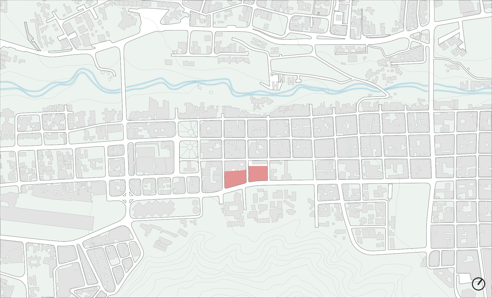
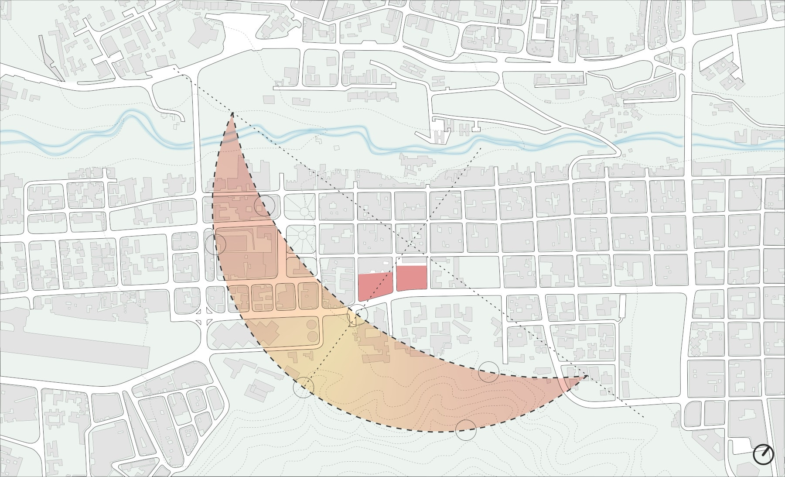
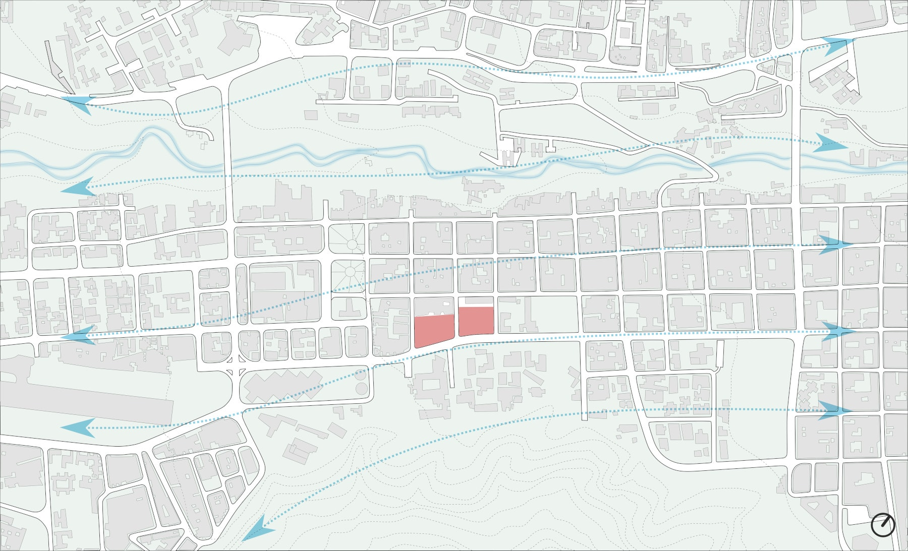
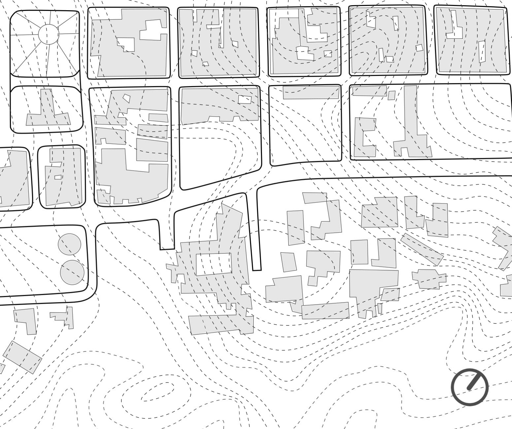
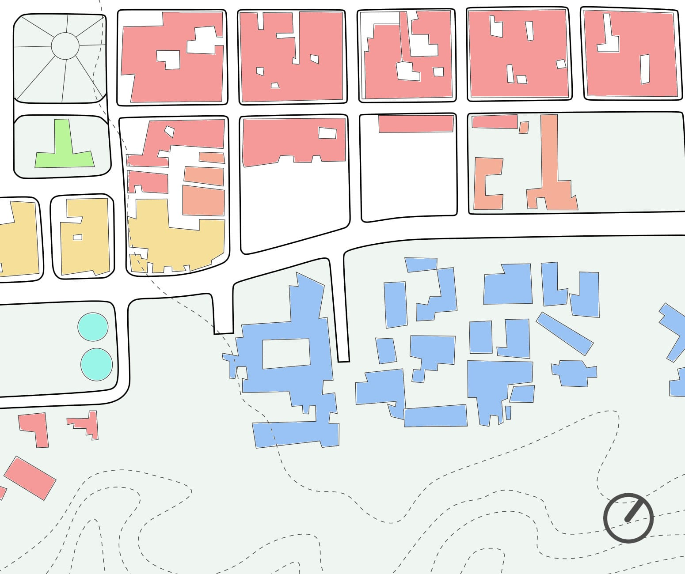
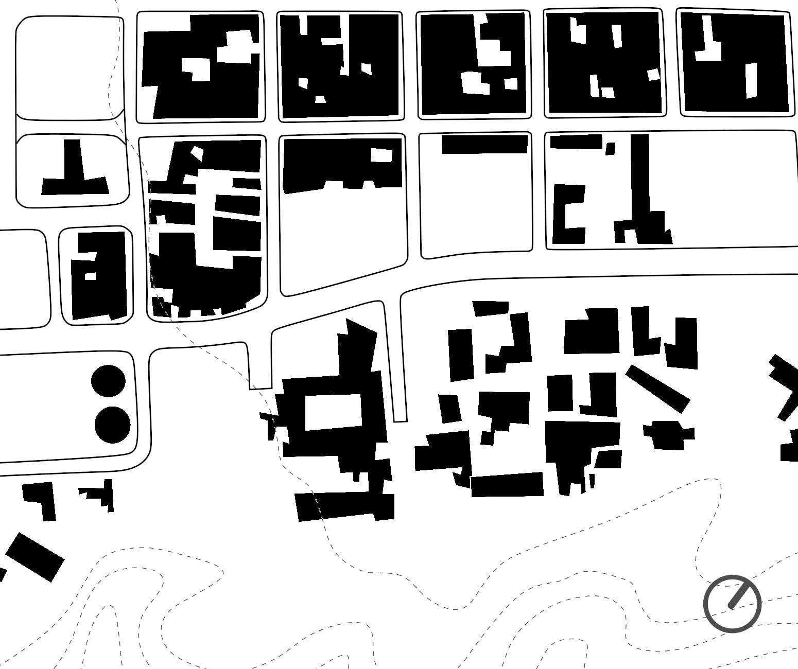
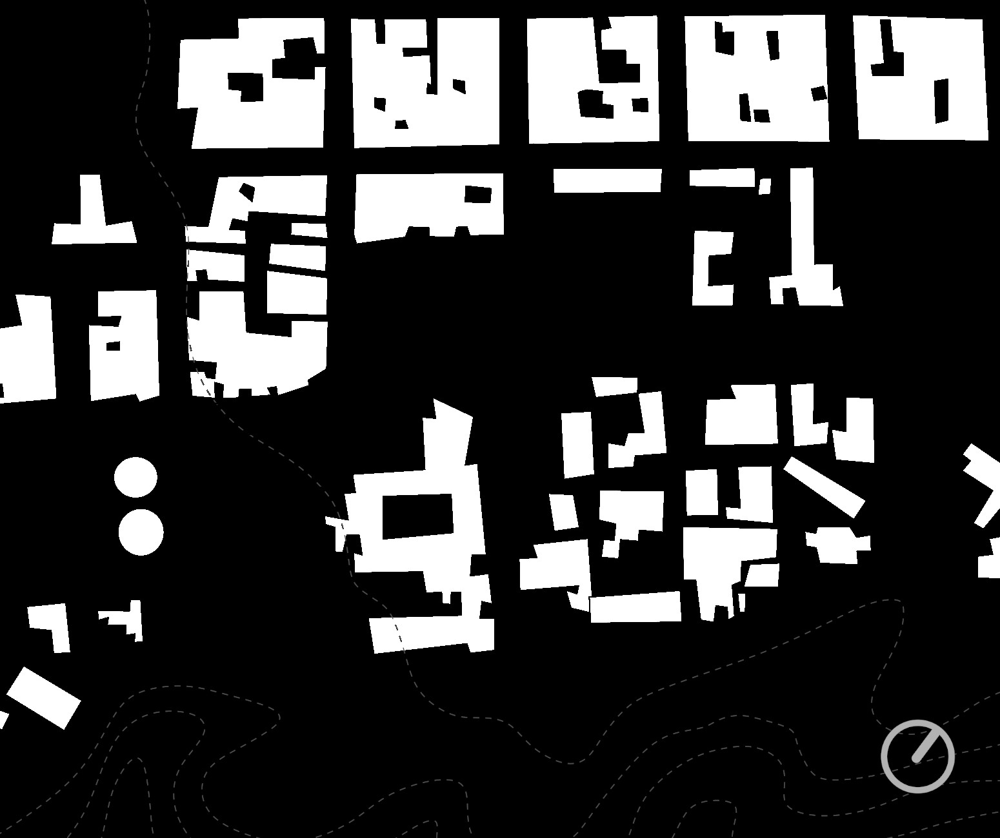
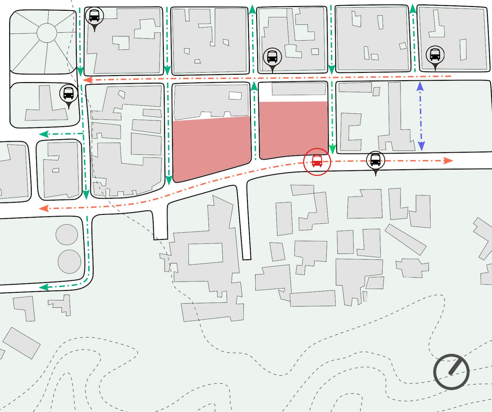

# Análisis del Terreno

## Localización

El terreno a intervenir se encuentra ubicado en el Casco Histórico de la ciudad de Mérida, en la Av. Don Tulio Febres Cordero entre calles 33, 34 y 35; dividido en dos parcelas en el centro de Mérida, parroquia el llano. Actualmente sirve de estacionamiento externo a la facultad de Medicina de la Universidad de Los Andes y por sus características y ubicación, se considera un terreno ideal para la propuesta ya que se encuentra en una de las principales vías de circulación del centro de la ciudad lo que le confiere una mayor visibilidad por parte de los principales flujos vehiculares de la misma.

La parcela ubicada entre las calles 34 y 35 (a la izquierda del plano); cuenta con un área de 5269 m2 y la parcela ubicada entre las calles 33 y 34, con un área de 4857 m2.

<!--  -->

> **Figura 72:**
> *Localización del terreno*.
> *Fuente propia.*

## Variables Ambientales

### Incidencia Solar

Mérida se encuentra en la zona intertropical, situándose a 8॰ de latitud respecto al ecuador terrrestre; la inclinación solar mínima se presenta en el mes de diciembre con 58,6॰ y la máxima en los meses de marzo y septiembre con 62॰. No es recomendable proyectar edificios con fachadas acristaladas en dirección hacia el sur, ya que la radiación solar es constante y de considerable intensidad a lo largo del año.

<!--  -->

> **Figura 73:**
> *Esquema de incidencia solar anual*.
> *Fuente propia.*

### Temperatura

Mérida posee un clima tropical con temperaturas moderadas debido a la situación geográfica de la ciudad dentro de la cordillera andina y a su gran altitud. La temperatura de la ciudad varía de norte a sur según la altitud. Los registros oscilan entre 18॰C y 24॰C, determinando un promedio general de 17,8 ॰C.

### Precipitación

Las precipitaciones son de intensidad media durante las épocas de lluvia, desde el mes de abril hasta el mes de noviembre. El promedio de pluviosidad anual es de 1400mm.

### Vientos

Los vientos predominantes durante el día inciden hacia el noreste y durante la noche hacia el suroeste; son canalizados por el valle donde se emplaza la ciudad.

<!--  -->

> **Figura 74:**
> *Direccionalidad de vientos predominantes*.
> *Fuente propia.*

### Suelos

La era geológica de la ciudad corresponde a la etapa del Cuaternario-Cenozoico que se inició hace aproximadamente 65,6 millones de años. La formación geológica se estableció en el Cuaternario-Pleistoceno, caracterizándose por mantener una topografía generada a través de terrazas y conos de deyección, por lo que gran parte del suelo se compone de rocas sedimentarias con contextura blanda e inconsistente.

El suelo de la ciudad es de tipo sedimentario aluvial y arcilloso, por lo que no se admiten edificaciones civiles superiores a 16 niveles. Por debajo de la ciudad, pasa la mayor falla tectónica activa del occidente del país, la falla de Boconó que forma parte de la Placa Suramericana.

Las parcelas destinadas al proyecto, son de estructura Franco Areno Arcilloso (FaA), que presenta las siguientes características mecánicas:

* La materia del suelo se considera uniforme a pesar de su complejidad topográfica.

* De poca profundidad, con alta presencia de componentes pétreos y escasa presencia de materia orgánica.

* De textura arcillosa predominante.
Casco Histórico
* Escasa permeabilidad y poco profundos.

### Pendiente del terreno

La pendiente del terreno es de 4,57% y puede considerarse sensiblemente plana por estar comprendida entre el 0% y el 5%.

<!--  -->

> **Figura 75:**
> *Topografía específica del terreno, cada cota marca un diferencial de 0,5 m en pendiente ascendente hacia el Norte*.
> *Fuente propia.*

## Variables Urbanas

La ciudad de Mérida se encuentra sobre una meseta, en un pequeño valle, que ocupa un área de unos 28 km de longitud por 5 km de ancho, por su morfología longitudinal y el desarrollo urbano, actualmente carece de terreno disponible para el desarrollo de nuevos planteamientos urbanos a gran escala. El área poligonal, ocupa unos 140 km2, de los cuales al menos 120 km2 son ocupados por la ciudad; y el resto por zonas de menor desarrollo o bien por algunos accidentes geográficos, de los que se destacan los taludes y montañas que delimitan la ciudad.

El trazado del terreno a intervenir, está determinado por la regularidad de la retícula vial generada desde la época colonial que caracteriza el Casco Histórico. La tipología edificatoria que se adjunta a la Av. Don Tulio Febres Cordero forma parte de un posterior desarrollo. La avenida se realizó como la continuación de la Av. 5 Zerpa a través de la extensión de los ejes de la trama de Damero que poseía el centro de la ciudad antes de la década de los cincuenta. De esta forma, por ser de desarrollo relativamente moderno, la imagen de la ciudad relacionada con el desarrollo de la avenida, diverge de la imagen colonial que conforma el patrimonio histórico de la ciudad.

La Av. Don Tulio Febres Cordero está relacionada a la expansión de las instalaciones de la Universidad de Los Andes, contando actualmente con las parcelas destinadas a la Facultad de Medicina, el Edificio Administrativo y una Residencia para estudiantes de la Universidad; además, el terreno seleccionado para el desarrollo de la propuesta arquitectónica del Museo de Arte Contemporáneo que actualmente se mantiene ocupado por espacios destinados a estacionamientos vehiculares.

### Usos del suelo

El terreno se encuentra según La Ordenanza en La Zona AR-3, que se destina para usos Residenciales Unifamiliar y Bi-familiar según el Plan de Ordenamiento Urbano. En la zona el uso del suelo está ligado a funciones Residenciales, Institucionales, Administrativas y Comerciales. En sus alrededores, el desarrollo urbano cuenta con instalaciones hoteleras, comerciales, gastronómicas y de uso público como la Plaza Glorias Patrias.

<!--  -->

> **Figura 76:**
> *Esquema de uso de suelos.*
> *Fuente propia.*
>
> Uso Residencial: Amarillo
> 
> Uso Educacional: Azul
>
> Uso Comercial: Rojo
>
> Servicio de agua potable: Turquesa
>
> Uso Institucional: Naranja
>
> Uso Militar: Verde

### Morfología del contexto

El contexto se puede identificar a través de la construcción reticular que representan los laterales y fondo de la parcela; el frente asociado al terreno compone el uso vehicular de la avenida y una mayor amplitud espacial determinada por los espacios ocupados por la Facultad de Medicina.

<!--  -->

> **Figura 77:**
> *Esquema de Fondo-Figura*.
> *Fuente propia.*

La imagen que proyecta la ciudad en el sector de emplazamiento, se compone por una serie de edificaciones con características modernas en el cual el uso principal lo abarcan las residencias y el comercio. La cualidad de la manzana define espacios comprimidos que determinan su amplitud el ancho de la vía vehicular. La Av. Don Tulio Febres Cordero determina una vialidad amplia que expande la percepción espacial del sector.

<!--  -->

> **Figura 78:**
> *Esquema de Figura-Fondo*.
> *Fuente propia.*

### Vialidad y transporte público

La vialidad principal que otorga mayor visibilidad a las parcelas de estudio es la constituida por la Av. Don Tulio Febres Cordero; en contraste, el fondo de las parcelas lo delimita la Av. 4 Bolivar. En el sentido transversal, las parcelas son interceptadas por las vías secundarias Calle 33 Boyacá, Calle 34 Flores, Calle 35 Santos Marquina.

Por la Av. Don Tulio Febres Cordero, transita el transporte masivo vial Trolebús de Mérida y contiene una parada del servicio justo en frente de la parcela de estudio constituyendo una ventaja de accesibilidad relacionada al terreno.

El sistema de trasporte público de la ciudad, cuenta con una serie de rutas de transporte en la Av. 4 Bolivar, Av. 3 Independencia y en la propia Av. Don Tulio Febres Cordero que incluyen paradas en las cercanías del emplazamiento, de modo que puede enfatizarse la accesibilidad peatonal al momento de considerar el desarrollo del proyecto.

<!--  -->

> **Figura 79:**
> *Esquema de vialidad y transporte público*.
> *Fuente propia.*
> 
> Vías de mayor afluencia vehicular: Naranja
>
> Vias de menor afluencia vehicular: Verde
>
> Pasos peatonales: Azul
>
> Parada de transporte público: Negro
>
> Parada del sistema público del Trolebús de Mérida: Rojo
